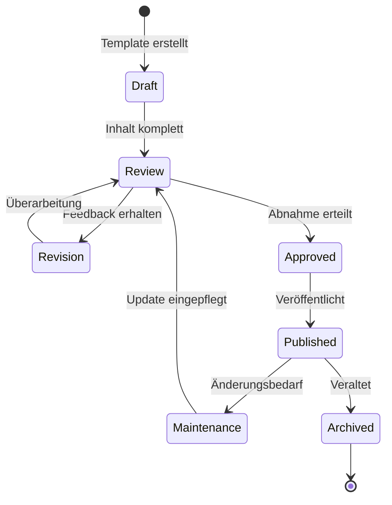
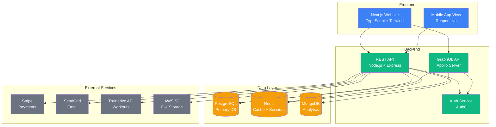

---
**Dokument:** TTOGFIT.COM Projektdokumentation – Masterauftrag  
**Version:** 2.0  
**Datum:** 07. November 2025  
**Status:** Finalisiert  
**Auftraggeber:** Alessio Garcia, TTOGFIT.COM  
**Auftragnehmer:** Beautify Pro GmbH  
**Klassifikation:** Vertraulich  
**Letzte Aktualisierung:** 2025-11-07  
---

# TTOGFIT.COM – Comprehensive Documentation Framework

## Dokumentensteuerung

### Versionsverlauf

| Version | Datum | Autor | Änderungen |
|---------|-------|-------|------------|
| 1.0 | 2024-XX-XX | Beautify Pro Team | Initiale Version |
| 2.0 | 2025-11-07 | Beautify Pro Team | Vollständige Überarbeitung, Modernisierung, Erweiterung |

### Dokumentenzweck

Dieses Masterdokument definiert den vollständigen Rahmen und die Spezifikationen für die Erstellung einer umfassenden Projektdokumentation der Personal-Training-Plattform TTOGFIT.COM. Es dient als verbindliche Arbeitsgrundlage für alle nachfolgenden Dokumentationsprozesse und gewährleistet eine konsistente, professionelle und vollständige Projektdokumentation.

### Zielgruppe

- **Primär:** Dokumentationsteam, Projektmanagement, Technische Redaktion
- **Sekundär:** Investoren, Entwicklungsteam, Qualitätssicherung
- **Tertiär:** Externe Partner, Behörden (Datenschutz)

### Dokumentenkonventionen

- Alle Datumsangaben im ISO-8601-Format (YYYY-MM-DD)
- Schweizer Hochdeutsch (formell)
- Markdown-Formatierung mit H1-H4 Hierarchie
- Mermaid-Diagramme als `.mmd` (Quelle) und `.svg` (Rendering)
- Konsistente Terminologie gemäss [`GLOSSARY.md`](docs/GLOSSARY.md)

---

## 1. Executive Summary

### 1.1 Projektvision

TTOGFIT.COM positioniert sich als führende internationale Premium-Personal-Training-Plattform, die traditionelles Hochleistungscoaching mit modernster digitaler Technologie verbindet. Die Plattform ermöglicht personalisierte Fitness- und Ernährungsbetreuung über geografische Grenzen hinweg, mit besonderem Fokus auf messbare Resultate, nachhaltige Verhaltensänderung und erstklassige Benutzererfahrung.

### 1.2 Dokumentationszweck

Die vorliegende Dokumentationsinitiative zielt darauf ab, ein vollständiges, druckfertiges Projektdossier zu erstellen, das:

- **Investoren** eine fundierte Entscheidungsgrundlage bietet
- **Entwicklungsteams** präzise technische Spezifikationen liefert
- **Marketingverantwortliche** mit strategischen Vorgaben ausstattet
- **Compliance-Beauftragte** rechtliche und regulatorische Anforderungen dokumentiert
- **Management** eine Basis für strategische Planung und Kontrolle bereitstellt

### 1.3 Dokumentationsumfang

Das Gesamtdossier umfasst **23 Hauptdokumente** und **18 technische Diagramme**, strukturiert in folgenden Kategorien:

1. **Business & Strategie** (5 Dokumente)
2. **Technische Architektur** (6 Dokumente)
3. **Benutzererfahrung & Design** (4 Dokumente)
4. **Compliance & Sicherheit** (3 Dokumente)
5. **Operations & Wartung** (3 Dokumente)
6. **Governance & Qualität** (2 Dokumente)

### 1.4 Alleinstellungsmerkmale der Dokumentation

- **Vollständigkeit:** Alle Aspekte von Business bis Technologie abgedeckt
- **Visualisierung:** Umfassende Diagramme für komplexe Zusammenhänge
- **Internationalisierung:** Mehrsprachigkeit und interkulturelle Aspekte berücksichtigt
- **Compliance-Fokus:** DSGVO, DSG, WCAG 2.1 AA vollständig dokumentiert
- **Zukunftssicherheit:** Skalierbarkeit und Erweiterbarkeit konzeptionell verankert
- **Praxisorientierung:** Konkrete Implementierungsvorgaben statt abstrakter Konzepte

### 1.5 Kritische Erfolgsfaktoren

1. **Konsistenz:** Einheitliche Terminologie und Struktur über alle Dokumente
2. **Nachvollziehbarkeit:** Jede Entscheidung dokumentiert und begründet
3. **Prüfbarkeit:** Klare Abnahmekriterien für jedes Lieferobjekt
4. **Wartbarkeit:** Versionierung und Change-Management von Beginn an
5. **Compliance:** Rechtssicherheit in allen relevanten Jurisdiktionen

---

## 2. Projektvision und strategische Ziele

### 2.1 Geschäftsmodell-Übersicht

#### 2.1.1 Marktsegmentierung

**Primärzielgruppe:**
- Berufstätige Führungskräfte (25-45 Jahre)
- Jahreseinkommen > CHF 100'000
- International mobil, mehrsprachig
- Gesundheitsbewusst, Ergebnisorientiert

**Sekundärzielgruppe:**
- Expatriates im DACH-Raum
- Leistungssportler in Transition
- Unternehmen (Corporate Wellness)

**Tertiärzielgruppe:**
- Fitness-Enthusiasten mit Vorerfahrung
- Personen mit spezifischen gesundheitlichen Zielen

#### 2.1.2 Wertversprechen

```
TTOGFIT = Premium Coaching × Digital Convenience × Messbare Resultate
```

**Kernkomponenten:**
1. **Personalisierung:** Individueller Trainings- und Ernährungsplan
2. **Verfügbarkeit:** 24/7 App-Zugang, flexible Video-Check-ins
3. **Accountability:** Wöchentliche Berichte, Community-Support
4. **Expertise:** Zertifizierter Coach mit internationaler Erfahrung
5. **Technologie:** Moderne App-Integration (Trainerize/My PT Hub)

### 2.2 SMART-Ziele

#### 2.2.1 Geschäftsziele (12 Monate)

| Ziel-ID | Beschreibung | Messgrösse | Zielwert | Zeitrahmen |
|---------|--------------|------------|----------|------------|
| BG-01 | Monatlich wiederkehrende Umsätze | MRR | CHF 50'000 | Q4 2026 |
| BG-02 | Aktive 1:1 Coaching-Kunden | Anzahl | 50 | Q4 2026 |
| BG-03 | Gruppenprogramm-Teilnehmer | Anzahl | 200 | Q4 2026 |
| BG-04 | App-Only Nutzer | Anzahl | 500 | Q4 2026 |
| BG-05 | Kundenbindungsrate | Retention | >85% | Kontinuierlich |

#### 2.2.2 Technische Ziele

| Ziel-ID | Beschreibung | Messgrösse | Zielwert | Zeitrahmen |
|---------|--------------|------------|----------|------------|
| TG-01 | Website-Ladezeit (LCP) | Sekunden | <2.5s | Launch |
| TG-02 | Mobile Performance Score | Lighthouse | >90 | Launch |
| TG-03 | Systemverfügbarkeit | Uptime | 99.5% | Kontinuierlich |
| TG-04 | API-Antwortzeit (P95) | Millisekunden | <500ms | Kontinuierlich |
| TG-05 | WCAG 2.1 Konformität | Level | AA | Launch |

#### 2.2.3 Marketing-Ziele

| Ziel-ID | Beschreibung | Messgrösse | Zielwert | Zeitrahmen |
|---------|--------------|------------|----------|------------|
| MG-01 | Organischer Traffic | Besuche/Monat | 10'000 | Q2 2026 |
| MG-02 | Conversion-Rate (Lead) | Prozent | 5% | Q2 2026 |
| MG-03 | CAC (Customer Acquisition Cost) | CHF | <500 | Q3 2026 |
| MG-04 | Email-Liste | Abonnenten | 5'000 | Q3 2026 |
| MG-05 | Social Media Reichweite | Follower | 20'000 | Q4 2026 |

### 2.3 Kernwerte und Positionierung

#### 2.3.1 Markenwerte

1. **Excellence:** Höchste Qualitätsstandards in allen Bereichen
2. **Transparency:** Offene Kommunikation über Prozesse und Resultate
3. **Empowerment:** Befähigung zur nachhaltigen Selbstverbesserung
4. **Innovation:** Nutzung modernster Technologie für optimale Ergebnisse
5. **Integrity:** Ehrliche Beratung ohne unrealistische Versprechen

#### 2.3.2 Brand Positioning Statement

> "TTOGFIT.COM ist die erste Wahl für ambitionierte Professionals, die ihre Fitness-Ziele mit wissenschaftlich fundiertem, personalisierten Coaching und modernster Technologie erreichen möchten – unabhängig von Standort oder Zeitzone."

### 2.4 Internationalisierungsstrategie

#### 2.4.1 Zielregionen (Phase 1-3)

**Phase 1 (Launch):**
- Schweiz (DE, FR, IT)
- Deutschland
- Österreich

**Phase 2 (6 Monate):**
- Vereinigtes Königreich
- Niederlande
- Skandinavien (EN)

**Phase 3 (12 Monate):**
- USA/Kanada
- Australien
- Singapur/Dubai

#### 2.4.2 Lokalisierungsanforderungen

- **Sprachen:** DE, EN, FR, IT (Phase 1)
- **Währungen:** CHF, EUR, GBP, USD (mit dynamischer Konvertierung)
- **Zeitzonen:** Automatische Erkennung und Anpassung (Buchungssystem)
- **Rechtliche Compliance:** Länderspezifische Datenschutzhinweise
- **Content:** Kulturell angepasste Testimonials und Marketingmaterialien

---

## 3. Dokumentationsarchitektur

### 3.1 Übersicht Dokumentenstruktur

```
/docs
├── /business                      # Geschäftsstrategie
├── /technical                     # Technische Architektur
├── /ux-design                     # Benutzererfahrung
├── /compliance                    # Rechtliches & Sicherheit
├── /operations                    # Betrieb & Wartung
├── /governance                    # Steuerung & Qualität
├── /diagrams                      # Alle Mermaid-Diagramme
│   ├── *.mmd                     # Mermaid-Quelldateien
│   └── *.svg                     # Gerenderte SVG-Diagramme
├── /templates                     # Wiederverwendbare Vorlagen
├── /examples                      # Beispielimplementierungen
└── /print_bundle                  # Druckfertige PDFs
    ├── ttogfit_complete_dossier.pdf
    ├── ttogfit_executive_summary.pdf
    ├── ttogfit_technical_specs.pdf
    └── ttogfit_compliance_pack.pdf
```

### 3.2 Dokumentenkategorien und Abhängigkeiten

#### 3.2.1 Business & Strategie

| Dokument | Priorität | Abhängigkeiten | Stakeholder |
|----------|-----------|----------------|-------------|
| [`BUSINESS_PLAN.md`](docs/business/BUSINESS_PLAN.md) | P0 | - | Management, Investoren |
| [`MARKET_ANALYSIS.md`](docs/business/MARKET_ANALYSIS.md) | P0 | BUSINESS_PLAN | Marketing, Management |
| [`REVENUE_MODEL.md`](docs/business/REVENUE_MODEL.md) | P0 | BUSINESS_PLAN | CFO, Investoren |
| [`MARKETING_STRATEGY.md`](docs/business/MARKETING_STRATEGY.md) | P1 | MARKET_ANALYSIS | Marketing |
| [`BRAND_GUIDELINES.md`](docs/business/BRAND_GUIDELINES.md) | P1 | MARKETING_STRATEGY | Marketing, Design |

#### 3.2.2 Technische Architektur

| Dokument | Priorität | Abhängigkeiten | Stakeholder |
|----------|-----------|----------------|-------------|
| [`TECHNICAL_ARCHITECTURE.md`](docs/technical/TECHNICAL_ARCHITECTURE.md) | P0 | BUSINESS_PLAN | CTO, Entwicklung |
| [`DATA_MODEL.md`](docs/technical/DATA_MODEL.md) | P0 | TECHNICAL_ARCHITECTURE | Backend-Dev, DBA |
| [`API_SPECIFICATIONS.md`](docs/technical/API_SPECIFICATIONS.md) | P1 | DATA_MODEL | Backend-Dev, Frontend-Dev |
| [`INTEGRATION_GUIDE.md`](docs/technical/INTEGRATION_GUIDE.md) | P1 | API_SPECIFICATIONS | DevOps, Backend-Dev |
| [`PERFORMANCE_STRATEGY.md`](docs/technical/PERFORMANCE_STRATEGY.md) | P1 | TECHNICAL_ARCHITECTURE | DevOps, Frontend-Dev |
| [`SCALABILITY_PLAN.md`](docs/technical/SCALABILITY_PLAN.md) | P2 | TECHNICAL_ARCHITECTURE | CTO, DevOps |

#### 3.2.3 Benutzererfahrung & Design

| Dokument | Priorität | Abhängigkeiten | Stakeholder |
|----------|-----------|----------------|-------------|
| [`INFORMATION_ARCHITECTURE.md`](docs/ux-design/INFORMATION_ARCHITECTURE.md) | P0 | BUSINESS_PLAN | UX-Designer, Frontend-Dev |
| [`USER_JOURNEY_MAPS.md`](docs/ux-design/USER_JOURNEY_MAPS.md) | P0 | INFORMATION_ARCHITECTURE | UX-Designer, Product Owner |
| [`ACCESSIBILITY_CONCEPT.md`](docs/ux-design/ACCESSIBILITY_CONCEPT.md) | P0 | INFORMATION_ARCHITECTURE | UX-Designer, QA |
| [`DESIGN_SYSTEM.md`](docs/ux-design/DESIGN_SYSTEM.md) | P1 | BRAND_GUIDELINES | UI-Designer, Frontend-Dev |

#### 3.2.4 Compliance & Sicherheit

| Dokument | Priorität | Abhängigkeiten | Stakeholder |
|----------|-----------|----------------|-------------|
| [`SECURITY_PRIVACY_BRIEF.md`](docs/compliance/SECURITY_PRIVACY_BRIEF.md) | P0 | TECHNICAL_ARCHITECTURE | Security Officer, Legal |
| [`GDPR_DSG_COMPLIANCE.md`](docs/compliance/GDPR_DSG_COMPLIANCE.md) | P0 | SECURITY_PRIVACY_BRIEF | Legal, DPO |
| [`TERMS_CONDITIONS_BRIEF.md`](docs/compliance/TERMS_CONDITIONS_BRIEF.md) | P1 | REVENUE_MODEL | Legal |

#### 3.2.5 Operations & Wartung

| Dokument | Priorität | Abhängigkeiten | Stakeholder |
|----------|-----------|----------------|-------------|
| [`OPERATIONS_RUNBOOK.md`](docs/operations/OPERATIONS_RUNBOOK.md) | P0 | TECHNICAL_ARCHITECTURE | DevOps, Support |
| [`MONITORING_ALERTING.md`](docs/operations/MONITORING_ALERTING.md) | P1 | OPERATIONS_RUNBOOK | DevOps, SRE |
| [`DISASTER_RECOVERY.md`](docs/operations/DISASTER_RECOVERY.md) | P1 | OPERATIONS_RUNBOOK | DevOps, Management |

#### 3.2.6 Governance & Qualität

| Dokument | Priorität | Abhängigkeiten | Stakeholder |
|----------|-----------|----------------|-------------|
| [`QUALITY_ASSURANCE.md`](docs/governance/QUALITY_ASSURANCE.md) | P0 | ALL | QA, Management |
| [`DOCUMENTATION_STANDARDS.md`](docs/governance/DOCUMENTATION_STANDARDS.md) | P0 | - | Alle Teams |

#### 3.2.7 Unterstützende Dokumente

| Dokument | Priorität | Abhängigkeiten | Stakeholder |
|----------|-----------|----------------|-------------|
| [`README.md`](docs/README.md) | P0 | - | Alle |
| [`GLOSSARY.md`](docs/GLOSSARY.md) | P0 | - | Alle |
| [`DECISIONS.md`](docs/DECISIONS.md) | P1 | - | Architekten, Management |
| [`DELIVERY_ROADMAP.md`](docs/DELIVERY_ROADMAP.md) | P0 | ALL | Management, PM |
| [`HANDOVER_CHECKLIST.md`](docs/HANDOVER_CHECKLIST.md) | P1 | ALL | PM, Kunde |

### 3.3 Dokumenten-Lebenszyklus



---

## 4. Detaillierte Dokumentspezifikationen

### 4.1 Business & Strategie Dokumente

#### 4.1.1 BUSINESS_PLAN.md

**Zweck:** Umfassende Darstellung der Geschäftsstrategie, Marktpositionierung und Monetarisierung

**Umfang:** 15-20 Seiten

**Hauptkapitel:**
1. Executive Summary
2. Unternehmensvision und Mission
3. Marktanalyse und Wettbewerbslandschaft
4. Zielgruppensegmentierung
5. Produktlinien und Services
   - 1:1 Premium Coaching
   - Gruppenprogramme
   - App-basiertes Coaching
   - Corporate Wellness Packages
6. Umsatzmodell und Pricing-Strategie
7. Go-to-Market Strategie
8. Finanzprognosen (3 Jahre)
9. Risikomanagement
10. Erfolgskennzahlen (KPIs)

**Eingebettete Diagramme:**
- [`business-model-canvas.mmd/.svg`](docs/diagrams/business-model-canvas.svg)
- [`revenue-streams.mmd/.svg`](docs/diagrams/revenue-streams.svg)
- [`customer-funnel.mmd/.svg`](docs/diagrams/customer-funnel.svg)

**Qualitätskriterien:**
- [ ] Alle Finanzannahmen dokumentiert und begründet
- [ ] SWOT-Analyse vollständig
- [ ] Wettbewerber mit mindestens 5 Vergleichspunkten analysiert
- [ ] Pricing durch Marktforschung validiert
- [ ] KPIs mit Messverfahren hinterlegt

#### 4.1.2 MARKET_ANALYSIS.md

**Zweck:** Detaillierte Analyse des Personal-Training-Marktes und Identifikation von Chancen

**Umfang:** 10-12 Seiten

**Hauptkapitel:**
1. Marktgrösse und Wachstumsprognosen
2. Marktsegmente
   - Premium Online Coaching
   - Hybrid Models
   - App-only Solutions
   - Corporate Wellness
3. Geografische Marktanalyse (CH, DE, AT, UK, US)
4. Kundenbedürfnisse und Pain Points
5. Wettbewerbsanalyse
   - Direkte Wettbewerber
   - Indirekte Wettbewerber
   - Substitutionsprodukte
6. Markttrends und -entwicklungen
7. Marktbarrieren und Regulierungen
8. Chancen und Risiken

**Eingebettete Diagramme:**
- [`market-size-forecast.mmd/.svg`](docs/diagrams/market-size-forecast.svg)
- [`competitor-matrix.mmd/.svg`](docs/diagrams/competitor-matrix.svg)

**Qualitätskriterien:**
- [ ] Marktdaten aus mindestens 3 unabhängigen Quellen
- [ ] Wettbewerber-Benchmarking mit min. 10 Parametern
- [ ] Kundenbefragungen dokumentiert (min. 50 Personen)
- [ ] Alle Aussagen mit Quellen belegt

#### 4.1.3 REVENUE_MODEL.md

**Zweck:** Detaillierte Beschreibung aller Einnahmequellen und Pricing-Strukturen

**Umfang:** 8-10 Seiten

**Hauptkapitel:**
1. Übersicht Einnahmequellen
2. Pricing-Strategie
   - Value-based Pricing
   - Tiered Pricing (Basic, Premium, Elite)
   - Geografische Preisanpassungen
3. Produktlinien-Pricing
   - 1:1 Coaching (CHF 1'500-3'000/Monat)
   - Gruppenprogramme (CHF 300-500/Monat)
   - App-Only (CHF 50-100/Monat)
   - Corporate Packages (Custom)
4. Zusatzleistungen und Upselling
   - Ernährungsberatung
   - Body-Composition-Analysen
   - Supplement-Beratung
   - Event-Teilnahmen
5. Rabattstrukturen und Promotions
6. Zahlungsmodalitäten
7. Customer Lifetime Value (CLV) Berechnungen
8. Churn-Management

**Eingebettete Diagramme:**
- [`revenue-breakdown.mmd/.svg`](docs/diagrams/revenue-breakdown.svg)
- [`pricing-tiers.mmd/.svg`](docs/diagrams/pricing-tiers.svg)
- [`clv-calculation.mmd/.svg`](docs/diagrams/clv-calculation.svg)

**Qualitätskriterien:**
- [ ] Alle Preise marktvalidiert
- [ ] CLV-Modell mit realistischen Annahmen
- [ ] Upselling-Pfade definiert
- [ ] Rabattlogik dokumentiert
- [ ] Payment-Provider-Gebühren berücksichtigt

#### 4.1.4 MARKETING_STRATEGY.md

**Zweck:** Umfassende Marketingstrategie für Kundenakquise und -bindung

**Umfang:** 12-15 Seiten

**Hauptkapitel:**
1. Marketing-Ziele und KPIs
2. Zielgruppen-Personas (min. 4 detaillierte Personas)
3. Brand Positioning
4. Marketing-Mix (4P/7P)
5. Kanalstrategie
   - SEO / Content Marketing
   - Social Media (Instagram, YouTube, LinkedIn)
   - Paid Advertising (Google Ads, Meta Ads)
   - Email Marketing
   - Influencer Partnerships
   - Affiliate Marketing
   - PR und Medienarbeit
6. Content-Strategie
7. Lead Generation Funnel
8. Conversion-Optimierung
9. Retention-Marketing
10. Budget-Allokation
11. Erfolgsmessung und Analytics

**Eingebettete Diagramme:**
- [`marketing-funnel.mmd/.svg`](docs/diagrams/marketing-funnel.svg)
- [`channel-strategy.mmd/.svg`](docs/diagrams/channel-strategy.svg)
- [`content-calendar.mmd/.svg`](docs/diagrams/content-calendar.svg)

**Qualitätskriterien:**
- [ ] CAC für jeden Kanal berechnet
- [ ] Content-Plan für 6 Monate
- [ ] A/B-Test-Hypothesen definiert
- [ ] Tracking-Implementierung spezifiziert
- [ ] Budget vs. erwarteter ROI dokumentiert

#### 4.1.5 BRAND_GUIDELINES.md

**Zweck:** Einheitliche Markenführung über alle Touchpoints

**Umfang:** 8-10 Seiten

**Hauptkapitel:**
1. Brand Purpose und Values
2. Brand Personality
3. Tone of Voice
   - Deutsch (formell, motivierend)
   - English (professional, approachable)
   - Französisch (élégant, précis)
   - Italienisch (caloroso, professionale)
4. Visuelles Erscheinungsbild
   - Logo-Varianten
   - Farbpalette (Primär, Sekundär, Akzent)
   - Typografie
   - Bildsprache
   - Iconographie
5. Anwendungsbeispiele
6. Do's and Don'ts

**Qualitätskriterien:**
- [ ] Farbwerte in HEX, RGB, CMYK definiert
- [ ] Web-Safe-Fonts spezifiziert
- [ ] Mindestabstände für Logo definiert
- [ ] Barrierefreie Farbkontraste geprüft (WCAG AA)

---

### 4.2 Technische Architektur Dokumente

#### 4.2.1 TECHNICAL_ARCHITECTURE.md

**Zweck:** Systemarchitektur und technische Grundsatzentscheidungen

**Umfang:** 18-25 Seiten

**Hauptkapitel:**
1. Architektur-Überblick
2. Systemkomponenten
   - **Frontend:**
     - Next.js 14+ (React 18) mit App Router
     - TypeScript für Type Safety
     - Tailwind CSS + shadcn/ui Component Library
     - React Query für State Management
     - next-intl für Internationalisierung
   - **Backend:**
     - Node.js (Express/NestJS) REST API
     - GraphQL für komplexe Abfragen
     - PostgreSQL (primäre Datenbank)
     - Redis (Caching, Sessions)
     - MongoDB (Analytics, Logs)
   - **Authentication:**
     - Auth0 / Clerk
     - Multi-Factor Authentication (MFA)
     - Social Login (Google, Apple)
   - **Payments:**
     - Stripe (primär)
     - SumUp (Schweiz)
     - PayPal (international)
   - **Email:**
     - SendGrid (transactional)
     - Mailchimp (marketing)
   - **Storage:**
     - AWS S3 / Cloudflare R2
     - CDN: Cloudflare
   - **Hosting:**
     - Vercel (Frontend)
     - AWS ECS / Railway (Backend)
   - **Monitoring:**
     - Sentry (Error Tracking)
     - Plausible Analytics (Privacy-friendly)
     - LogRocket (Session Replay)
3. Datenflüsse
4. Schnittstellen (APIs)
5. Sicherheitsarchitektur
6. Skalierungsstrategie
7. Technologie-Stack-Begründung

**Eingebettete Diagramme:**
- [`system-architecture.mmd/.svg`](docs/diagrams/system-architecture.svg)
- [`deployment-architecture.mmd/.svg`](docs/diagrams/deployment-architecture.svg)
- [`network-topology.mmd/.svg`](docs/diagrams/network-topology.svg)
- [`data-flow-overview.mmd/.svg`](docs/diagrams/data-flow-overview.svg)

**Qualitätskriterien:**
- [ ] Alle Technologieentscheidungen begründet (siehe DECISIONS.md)
- [ ] Alternativen evaluiert und dokumentiert
- [ ] Lizenzierung geklärt
- [ ] Kosten geschätzt (Entwicklung + Betrieb)
- [ ] Skalierbarkeit bis 10'000 Nutzer nachgewiesen

#### 4.2.2 DATA_MODEL.md

**Zweck:** Umfassende Beschreibung des Datenmodells

**Umfang:** 15-20 Seiten

**Hauptkapitel:**
1. Entity-Relationship-Übersicht
2. Core Entities
   - **User/Profile**
     - id, email, name, language, timezone, country
     - subscription_tier, status, created_at, updated_at
   - **Client**
     - user_id, coach_id, program_id
     - goals, measurements, preferences
   - **Coach**
     - user_id, specializations, certifications
     - availability, hourly_rate
   - **Program**
     - id, name, type (1:1, group, app)
     - duration, price, currency
   - **Workout**
     - id, client_id, date, exercises[]
     - duration, notes, completed
   - **Exercise**
     - id, name, category, equipment
     - instructions, video_url
   - **Nutrition**
     - client_id, date, meals[], macros
   - **Payment**
     - id, user_id, amount, currency, status
     - payment_method, stripe_payment_id
   - **Subscription**
     - id, user_id, plan_id, status
     - current_period_start, current_period_end
3. Relationships und Constraints
4. Indices und Optimierung
5. Data Retention Policies
6. Migration Strategy

**Eingebettete Diagramme:**
- [`entity-relationship.mmd/.svg`](docs/diagrams/entity-relationship.svg)
- [`data-lifecycle.mmd/.svg`](docs/diagrams/data-lifecycle.svg)

**Qualitätskriterien:**
- [ ] Alle Beziehungen typisiert (1:1, 1:n, n:m)
- [ ] Normalisierung begründet (3NF empfohlen)
- [ ] Indizes für Hauptabfragen definiert
- [ ] GDPR-Löschprozesse modelliert
- [ ] Datenmigration geplant

#### 4.2.3 API_SPECIFICATIONS.md

**Zweck:** RESTful API und GraphQL Schema Dokumentation

**Umfang:** 20-30 Seiten

**Hauptkapitel:**
1. API-Architektur-Übersicht
2. REST Endpoints
   - Authentication (`/api/v1/auth/*`)
   - Users (`/api/v1/users/*`)
   - Programs (`/api/v1/programs/*`)
   - Workouts (`/api/v1/workouts/*`)
   - Payments (`/api/v1/payments/*`)
   - Analytics (`/api/v1/analytics/*`)
3. GraphQL Schema
4. Request/Response Examples
5. Error Handling
6. Rate Limiting
7. Versioning Strategy
8. Authentication & Authorization
9. Webhook Specifications

**Format:**
- OpenAPI 3.1 Specification (YAML)
- GraphQL Schema Definition Language (SDL)

**Qualitätskriterien:**
- [ ] Alle Endpoints mit Beispielen dokumentiert
- [ ] Error Codes vollständig definiert (4xx, 5xx)
- [ ] Rate Limits pro Endpoint spezifiziert
- [ ] Authentication Flows getestet
- [ ] OpenAPI-Spec validiert (Swagger Validator)

#### 4.2.4 INTEGRATION_GUIDE.md

**Zweck:** Integration mit Drittanbietern und externen Services

**Umfang:** 12-15 Seiten

**Hauptkapitel:**
1. Integrations-Übersicht
2. **Coaching-Plattformen**
   - Trainerize API
   - My PT Hub API
   - Synchronisation von Workouts, Ernährung, Progress
3. **Payment Providers**
   - Stripe (Subscriptions, One-time payments)
   - SumUp (POS, Invoices)
   - PayPal (Alternative payment)
4. **Email Services**
   - SendGrid (Transaktionale Mails)
   - Mailchimp (Newsletter, Automation)
5. **Calendar Integration**
   - Calendly (Booking)
   - Google Calendar (Sync)
6. **Analytics**
   - Plausible Analytics
   - Google Analytics 4 (optional)
7. **CRM**
   - HubSpot / Pipedrive
8. **Social Media**
   - Instagram API (Testimonials)
   - YouTube API (Video-Content)
9. Error Handling und Fallback-Strategien

**Eingebettete Diagramme:**
- [`integration-architecture.mmd/.svg`](docs/diagrams/integration-architecture.svg)
- [`oauth-flow.mmd/.svg`](docs/diagrams/oauth-flow.svg)

**Qualitätskriterien:**
- [ ] API-Keys und Secrets-Management dokumentiert
- [ ] Webhook-Handling definiert
- [ ] Retry-Logic spezifiziert
- [ ] Monitoring für jede Integration

#### 4.2.5 PERFORMANCE_STRATEGY.md

**Zweck:** Performance-Optimierung und Core Web Vitals

**Umfang:** 10-12 Seiten

**Hauptkapitel:**
1. Performance-Ziele
   - **LCP (Largest Contentful Paint):** <2.5s
   - **FID (First Input Delay):** <100ms
   - **CLS (Cumulative Layout Shift):** <0.1
   - **TTFB (Time to First Byte):** <600ms
2. Frontend-Optimierung
   - Code Splitting
   - Lazy Loading
   - Image Optimization (WebP, AVIF)
   - Font Optimization
   - Critical CSS
3. Backend-Optimierung
   - Database Query Optimization
   - Caching Strategy (Redis)
   - API Response Compression
4. CDN-Strategie
5. Monitoring und Alerting
6. Performance Budget

**Qualitätskriterien:**
- [ ] Lighthouse Score >90 Mobile & Desktop
- [ ] Performance Budget definiert (JS <200KB, Images <500KB)
- [ ] Caching-Strategie dokumentiert
- [ ] Load Testing durchgeführt (min. 1000 concurrent users)

#### 4.2.6 SCALABILITY_PLAN.md

**Zweck:** Langfristige Skalierungsstrategie

**Umfang:** 8-10 Seiten

**Hauptkapitel:**
1. Skalierungs-Szenarien
   - 100 Nutzer (Launch)
   - 1'000 Nutzer (6 Monate)
   - 10'000 Nutzer (18 Monate)
   - 100'000 Nutzer (36 Monate)
2. Horizontal vs. Vertical Scaling
3. Database Sharding Strategy
4. Load Balancing
5. Auto-Scaling Configuration
6. Cost Projections

**Qualitätskriterien:**
- [ ] Skalierungskosten berechnet
- [ ] Bottlenecks identifiziert
- [ ] Migrationspfad dokumentiert

---

### 4.3 Benutzererfahrung & Design Dokumente

#### 4.3.1 INFORMATION_ARCHITECTURE.md

**Zweck:** Strukturelle Blueprint der Website und App

**Umfang:** 12-15 Seiten

**Hauptkapitel:**
1. Sitemap (vollständig)
   - **Public Pages:**
     - Home (`/`)
     - About (`/about`)
     - Programs (`/programs`, `/programs/[slug]`)
     - Results (`/results`)
     - Blog (`/blog`, `/blog/[slug]`)
     - Contact (`/contact`)
     - Free Resources (`/resources`)
   - **Authenticated Pages:**
     - Dashboard (`/dashboard`)
     - Workouts (`/dashboard/workouts`)
     - Nutrition (`/dashboard/nutrition`)
     - Progress (`/dashboard/progress`)
     - Community (`/dashboard/community`)
     - Profile (`/dashboard/profile`)
   - **Admin Pages:**
     - Admin Dashboard (`/admin`)
     - Client Management (`/admin/clients`)
     - Content Management (`/admin/content`)
     - Analytics (`/admin/analytics`)
2. Content Modules pro Seite
3. Navigation-Konzept
   - Primary Navigation
   - Footer Navigation
   - User Navigation (logged in)
   - Breadcrumbs
4. Crosslinking-Strategie
5. Mobile Navigation

**Eingebettete Diagramme:**
- [`sitemap.mmd/.svg`](docs/diagrams/sitemap.svg)
- [`navigation-hierarchy.mmd/.svg`](docs/diagrams/navigation-hierarchy.svg)
- [`content-model.mmd/.svg`](docs/diagrams/content-model.svg)

**Qualitätskriterien:**
- [ ] 3-Klick-Regel eingehalten
- [ ] Breadcrumb-Navigation für alle Unterseiten
- [ ] Mobile-First Navigation getestet
- [ ] Barrierefreiheit (Keyboard-Navigation)

#### 4.3.2 USER_JOURNEY_MAPS.md

**Zweck:** Detaillierte Nutzerflüsse für alle Hauptszenarien

**Umfang:** 15-20 Seiten

**Hauptkapitel:**
1. Journey Map Methodik
2. **Persona 1: First-Time Visitor (Awareness)**
   - Touchpoints: Google Search → Landing Page → Testimonials → Lead Form
   - Emotionen: Neugierig → Skeptisch → Überzeugt
   - Pain Points: Vertrauensaufbau, Preistransparenz
3. **Persona 2: Lead (Consideration)**
   - Touchpoints: Email → Calendly Booking → Video Call → Contract
   - Emotionen: Interessiert → Abwägend → Entschlossen
   - Pain Points: Zeitlicher Aufwand, Commitment
4. **Persona 3: New Client (Onboarding)**
   - Touchpoints: Payment → Welcome Email → App Setup → First Workout
   - Emotionen: Aufgeregt → Überfördert → Motiviert
   - Pain Points: Technische Hürden, Erwartungsmanagement
5. **Persona 4: Active Client (Engagement)**
   - Touchpoints: Daily App Usage → Weekly Check-ins → Progress Tracking
   - Emotionen: Motiviert → Frustriert (Plateau) → Stolz (Fortschritt)
   - Pain Points: Motivation, Accountability
6. **Persona 5: Churning Client (Retention)**
   - Touchpoints: Inaktivität → Re-engagement Email → Survey → Win-back Offer
   - Emotionen: Frustriert → Schuldgefühle → Ambivalent
   - Pain Points: Zeitmangel, fehlende Resultate

**Eingebettete Diagramme:**
- [`journey-awareness.mmd/.svg`](docs/diagrams/journey-awareness.svg)
- [`journey-conversion.mmd/.svg`](docs/diagrams/journey-conversion.svg)
- [`journey-onboarding.mmd/.svg`](docs/diagrams/journey-onboarding.svg)
- [`journey-retention.mmd/.svg`](docs/diagrams/journey-retention.svg)

**Qualitätskriterien:**
- [ ] Mindestens 5 detaillierte Journey Maps
- [ ] Emotionen pro Touchpoint dokumentiert
- [ ] Pain Points mit Lösungsansätzen versehen
- [ ] Schnittstellen zwischen Journeys definiert

#### 4.3.3 ACCESSIBILITY_CONCEPT.md

**Zweck:** WCAG 2.1 Level AA Konformität sicherstellen

**Umfang:** 10-12 Seiten

**Hauptkapitel:**
1. Accessibility-Standards und Ziele
2. WCAG 2.1 AA Requirement Mapping
   - **Wahrnehmbar:**
     - Alt-Texte für alle Bilder
     - Untertitel für Videos
     - Farbkontrast min. 4.5:1 (Text), 3:1 (UI)
   - **Bedienbar:**
     - Keyboard-Navigation (kein Mauserfordernis)
     - Skip Links
     - Focus Indicators
   - **Verständlich:**
     - Klare Sprache (Lesbarkeitsindex)
     - Fehlermeldungen mit Lösungsvorschlägen
   - **Robust:**
     - Semantisches HTML
     - ARIA-Labels wo erforderlich
3. Assistive Technology Testing
   - Screen Reader (NVDA, JAWS, VoiceOver)
   - Keyboard-Only Navigation
   - Voice Control
4. Accessibility Testing Tools
   - axe DevTools
   - WAVE
   - Lighthouse Accessibility Audit
5. Accessibility Statement
6. Feedback-Mechanismus für Barrieren

**Qualitätskriterien:**
- [ ] WCAG 2.1 AA Checklist zu 100% erfüllt
- [ ] Screen Reader Testing dokumentiert
- [ ] Keyboard Navigation vollständig
- [ ] Accessibility-Audit vor Launch

#### 4.3.4 DESIGN_SYSTEM.md

**Zweck:** Konsistente UI-Komponenten und Patterns

**Umfang:** 12-15 Seiten

**Hauptkapitel:**
1. Design Tokens
   - Colors (Primary, Secondary, Accent, Grays)
   - Typography (Font Families, Sizes, Weights, Line Heights)
   - Spacing (4pt Grid System)
   - Shadows
   - Border Radius
   - Breakpoints (Mobile, Tablet, Desktop)
2. Component Library
   - Atoms: Buttons, Inputs, Labels, Icons
   - Molecules: Form Groups, Cards, Navigation Items
   - Organisms: Header, Footer, Forms, Testimonial Carousels
   - Templates: Page Layouts
3. Interaction Patterns
   - Hover States
   - Focus States
   - Loading States
   - Error States
4. Responsive Behavior
5. Animation Guidelines
6. Icon System

**Referenz:** shadcn/ui als Basis, erweitert mit custom Components

**Qualitätskriterien:**
- [ ] Alle Komponenten dokumentiert (Props, States, Variants)
- [ ] Storybook oder ähnliches Tool für Dokumentation
- [ ] Barrierefreie Komponenten (ARIA)
- [ ] Dark Mode Support (optional)

---

### 4.4 Compliance & Sicherheit Dokumente

#### 4.4.1 SECURITY_PRIVACY_BRIEF.md

**Zweck:** Umfassende Sicherheits- und Datenschutzstrategie

**Umfang:** 15-18 Seiten

**Hauptkapitel:**
1. Security-Framework
   - **Application Security:**
     - Input Validation
     - Output Encoding
     - SQL Injection Prevention
     - XSS Prevention
     - CSRF Protection
   - **Infrastructure Security:**
     - HTTPS/TLS 1.3
     - HSTS (HTTP Strict Transport Security)
     - CSP (Content Security Policy)
     - Secure Headers (X-Frame-Options, etc.)
   - **Authentication Security:**
     - Password Hashing (bcrypt, Argon2)
     - Multi-Factor Authentication (MFA)
     - Session Management
     - Rate Limiting (Login Attempts)
   - **Data Security:**
     - Encryption at Rest (AES-256)
     - Encryption in Transit (TLS 1.3)
     - PII Data Minimization
     - Secure Data Deletion
2. Privacy by Design
   - Datenminimierung
   - Zweckbindung
   - Speicherbegrenzung
   - Privacy-First Analytics (Plausible)
3. Vulnerability Management
   - Dependency Scanning (Dependabot, Snyk)
   - SAST (Static Application Security Testing)
   - Penetration Testing (jährlich)
4. Incident Response Plan
5. Security Awareness Training

**Eingebettete Diagramme:**
- [`security-layers.mmd/.svg`](docs/diagrams/security-layers.svg)
- [`authentication-flow.mmd/.svg`](docs/diagrams/authentication-flow.svg)
- [`incident-response.mmd/.svg`](docs/diagrams/incident-response.svg)

**Qualitätskriterien:**
- [ ] OWASP Top 10 addressiert
- [ ] Penetration Test Report (vor Launch)
- [ ] Security Headers A+ Rating (securityheaders.com)
- [ ] Vulnerability Scan monatlich

#### 4.4.2 GDPR_DSG_COMPLIANCE.md

**Zweck:** DSGVO und Schweizer Datenschutzgesetz (DSG) Compliance

**Umfang:** 12-15 Seiten

**Hauptkapitel:**
1. Rechtsgrundlagen
   - DSGVO (EU)
   - DSG (Schweiz)
   - ePrivacy-Richtlinie
2. Datenverarbeitungsaktivitäten (Art. 30 DSGVO)
   - Verarbeitungszwecke
   - Kategorien personenbezogener Daten
   - Kategorien von Empfängern
   - Drittlandtransfers
   - Löschfristen
3. Rechtsgrundlagen für Verarbeitung
   - Einwilligung (Art. 6 Abs. 1 lit. a DSGVO)
   - Vertragserfüllung (Art. 6 Abs. 1 lit. b DSGVO)
   - Berechtigte Interessen (Art. 6 Abs. 1 lit. f DSGVO)
4. Betroffenenrechte
   - Auskunftsrecht (Art. 15 DSGVO)
   - Berichtigungsrecht (Art. 16 DSGVO)
   - Löschungsrecht (Art. 17 DSGVO)
   - Datenübertragbarkeit (Art. 20 DSGVO)
   - Widerspruchsrecht (Art. 21 DSGVO)
5. Cookie-Consent-Management
   - Cookie-Banner (GDPR-konform)
   - Granulares Opt-in
   - Cookie-Kategorisierung
6. Datenschutz-Folgenabschätzung (DSFA)
7. Auftragsverarbeitungsverträge (AVV)
8. Datenschutzerklärung (Privacy Policy)
9. Impressum

**Qualitätskriterien:**
- [ ] Privacy Policy rechtlich geprüft
- [ ] Cookie-Banner GDPR-konform (z.B. Cookiebot)
- [ ] AVV mit allen Dienstleistern vorhanden
- [ ] DSFA durchgeführt und dokumentiert
- [ ] Betroffenenrechte über Self-Service erfüllbar

#### 4.4.3 TERMS_CONDITIONS_BRIEF.md

**Zweck:** AGB, Widerrufsbelehrungen und vertragliche Grundlagen

**Umfang:** 8-10 Seiten

**Hauptkapitel:**
1. Allgemeine Geschäftsbedingungen (AGB)
   - Vertragsschluss
   - Leistungsumfang
   - Preise und Zahlungsbedingungen
   - Vertragslaufzeit und Kündigungsfristen
   - Haftungsbeschränkungen
2. Widerrufsbelehrung (EU-Verbraucher)
3. Nutzungsbedingungen (App/Dashboard)
4. Content-Nutzungsrechte
5. Gerichtsstand und anwendbares Recht

**Qualitätskriterien:**
- [ ] Rechtlich geprüft durch Fachanwalt
- [ ] Länderspezifische Anpassungen (CH, DE, AT, UK)
- [ ] Widerrufsbelehrung EU-konform
- [ ] Streitbeilegungsverfahren definiert

---

### 4.5 Operations & Wartung Dokumente

#### 4.5.1 OPERATIONS_RUNBOOK.md

**Zweck:** Operative Anleitung für Betrieb und Wartung

**Umfang:** 15-20 Seiten

**Hauptkapitel:**
1. Infrastruktur-Übersicht
   - Hosting-Provider (Vercel, AWS, etc.)
   - DNS-Management (Cloudflare)
   - SSL-Zertifikate
2. Deployment-Prozess
   - CI/CD Pipeline (GitHub Actions)
   - Staging vs. Production
   - Rollback-Verfahren
   - Blue-Green Deployment
3. Backup-Strategie
   - Datenbank Backups (täglich, 30 Tage Retention)
   - File Storage Backups (wöchentlich)
   - Disaster Recovery Time (RTO: 4 Stunden, RPO: 24 Stunden)
4. Monitoring-Setup
   - Uptime Monitoring (UptimeRobot, Pingdom)
   - Error Tracking (Sentry)
   - Performance Monitoring (Vercel Analytics, LogRocket)
5. Logging-Strategie
   - Application Logs (CloudWatch, Papertrail)
   - Access Logs
   - Audit Logs (GDPR)
6. Support-Prozesse
   - 1st Level Support (Chatbot, FAQ)
   - 2nd Level Support (Email, Video Call)
   - Eskalationspfade
7. Wartungsfenster
8. Change Management

**Eingebettete Diagramme:**
- [`deployment-pipeline.mmd/.svg`](docs/diagrams/deployment-pipeline.svg)
- [`backup-strategy.mmd/.svg`](docs/diagrams/backup-strategy.svg)

**Qualitätskriterien:**
- [ ] Runbooks für alle kritischen Prozesse
- [ ] Kontaktlisten aktuell
- [ ] Rollback getestet
- [ ] Disaster Recovery getestet (min. 1x jährlich)

#### 4.5.2 MONITORING_ALERTING.md

**Zweck:** Proaktives Monitoring und Alerting

**Umfang:** 10-12 Seiten

**Hauptkapitel:**
1. Monitoring-Strategie
   - Infrastructure Monitoring
   - Application Performance Monitoring (APM)
   - Real User Monitoring (RUM)
   - Synthetic Monitoring
2. Key Metrics
   - **Availability:** Uptime >99.5%
   - **Performance:** Response Time <500ms (P95)
   - **Errors:** Error Rate <1%
   - **Traffic:** Requests/minute
3. Alerting Rules
   - Critical Alerts (Pagerduty, sofort)
   - Warning Alerts (Email, 15min Delay)
   - Info Alerts (Slack, täglicher Digest)
4. On-Call Rotation
5. Dashboards
   - Executive Dashboard (KPIs)
   - Technical Dashboard (System Health)
   - Business Dashboard (Revenue, Users)

**Tools:**
- Sentry (Errors)
- Plausible Analytics (Web Analytics)
- LogRocket (Session Replay)
- UptimeRobot (Uptime)
- Vercel Analytics (Performance)

**Qualitätskriterien:**
- [ ] Alert Noise minimiert (keine False Positives)
- [ ] Mean Time to Detection (MTTD) <5 Minuten
- [ ] Mean Time to Resolution (MTTR) <1 Stunde

#### 4.5.3 DISASTER_RECOVERY.md

**Zweck:** Business Continuity und Disaster Recovery

**Umfang:** 8-10 Seiten

**Hauptkapitel:**
1. Disaster-Szenarien
   - Totaler Infrastruktur-Ausfall
   - Datenbank-Korruption
   - Cyber-Attack (Ransomware)
   - Datenverlust
2. Recovery Time Objective (RTO): 4 Stunden
3. Recovery Point Objective (RPO): 24 Stunden
4. Backup-Verification (wöchentlich)
5. Disaster Recovery Drill (halbjährlich)
6. Communication Plan
7. Business Continuity (Notfallbetrieb)

**Qualitätskriterien:**
- [ ] DR-Plan getestet
- [ ] Backup-Restore erfolgreich durchgeführt
- [ ] Kommunikationswege definiert

---

### 4.6 Governance & Qualität Dokumente

#### 4.6.1 QUALITY_ASSURANCE.md

**Zweck:** Qualitätssicherungsprozesse für Dokumentation

**Umfang:** 10-12 Seiten

**Hauptkapitel:**
1. Qualitätskriterien
   - Vollständigkeit
   - Korrektheit
   - Konsistenz
   - Aktualität
   - Verständlichkeit
2. Review-Prozess
   - Peer Review
   - Technical Review
   - Legal Review (für Compliance-Dokumente)
   - Management Approval
3. Checklisten pro Dokumenttyp
4. Versionierung (Semantic Versioning)
5. Change Log Pflicht
6. Abnahmekriterien

**Qualitätskriterien:**
- [ ] Alle Dokumente mindestens 2-fach reviewed
- [ ] Änderungen nachvollziehbar (Git History)
- [ ] Abnahme dokumentiert

#### 4.6.2 DOCUMENTATION_STANDARDS.md

**Zweck:** Einheitliche Dokumentationsrichtlinien

**Umfang:** 8-10 Seiten

**Hauptkapitel:**
1. Markdown-Konventionen
   - Überschriften-Hierarchie (H1-H4)
   - Listen (geordnet, ungeordnet)
   - Code-Blöcke (Syntax Highlighting)
   - Tabellen
   - Links (intern, extern)
2. Mermaid-Diagramm-Richtlinien
   - Naming Conventions
   - Farbschema
   - Export-Format
3. Datei-Naming
4. Metadaten-Template
5. Sprache und Ton
   - Schweizer Hochdeutsch (formell)
   - Aktive Formulierungen
   - Fachterminologie gemäss Glossary
6. Barrierefreiheit in Dokumentation
   - Alt-Texte für Diagramme
   - Beschreibende Link-Texte

**Qualitätskriterien:**
- [ ] Style Guide befolgt
- [ ] Linting (markdownlint)
- [ ] Broken Links geprüft

---

### 4.7 Unterstützende Dokumente

#### 4.7.1 README.md

**Zweck:** Einstiegspunkt und Übersicht über das gesamte Dossier

**Umfang:** 3-5 Seiten

**Hauptkapitel:**
1. Projektübersicht
2. Dokumentationsstruktur
3. Kurze Abstracts aller Dokumente
4. Navigations-Leitfaden
5. Kontaktinformationen

**Qualitätskriterien:**
- [ ] Alle Dokumente verlinkt
- [ ] Zielgruppe klar definiert

#### 4.7.2 GLOSSARY.md

**Zweck:** Einheitliche Terminologie

**Umfang:** 5-8 Seiten

**Inhalte:**
- **Fachbegriffe:** PT (Personal Training), MRR (Monthly Recurring Revenue), LTV (Lifetime Value), CAC (Customer Acquisition Cost)
- **Technische Begriffe:** API, JWT, OAuth, CDN, WCAG
- **Abkürzungen:** CH (Schweiz), DE (Deutschland), DSGVO (Datenschutz-Grundverordnung)
- **Branchenspezifisches:** Macros (Makronährstoffe), Progressive Overload, HIIT

**Qualitätskriterien:**
- [ ] Alphabetisch sortiert
- [ ] Alle verwendeten Fachbegriffe enthalten
- [ ] Englische + Deutsche Begriffe

#### 4.7.3 DECISIONS.md

**Zweck:** Architecture Decision Records (ADR)

**Umfang:** Fortlaufend, min. 10-15 Einträge

**Format:**
```markdown
## ADR-001: Next.js als Frontend-Framework

**Datum:** 2025-11-07
**Status:** Akzeptiert
**Kontext:** Wahl des Frontend-Frameworks
**Entscheidung:** Next.js 14 mit App Router
**Begründung:**
- Server-Side Rendering (SSR) für SEO
- Hybrid Static/Dynamic Rendering
- Built-in I18n Support
- Vercel-Integration für einfaches Deployment
**Alternativen:**
- Remix: Weniger Ecosystem
- Gatsby: Zu statisch-fokussiert
- Create React App: Kein SSR
**Konsequenzen:**
- Vendor Lock-in (Vercel)
- Lernkurve für Team
**Owner:** CTO
```

**Qualitätskriterien:**
- [ ] Alle Architekturentscheidungen dokumentiert
- [ ] Alternativen evaluiert
- [ ] Konsequenzen transparent

#### 4.7.4 DELIVERY_ROADMAP.md

**Zweck:** Phasenplan für Dokumentationserstellung und Projektumsetzung

**Umfang:** 8-10 Seiten

**Hauptkapitel:**
1. Projektphasen
   - **Phase 0: Konzeption** (4 Wochen)
     - Alle Dokumente erstellt
     - Diagramme finalisiert
     - Review abgeschlossen
   - **Phase 1: Design** (6 Wochen)
     - Wireframes
     - High-Fidelity Mockups
     - Design System
   - **Phase 2: Entwicklung MVP** (12 Wochen)
     - Core Features
     - Payment Integration
     - 1:1 Coaching Module
   - **Phase 3: Beta-Test** (4 Wochen)
     - 10 Beta-Kunden
     - Feedback-Integration
   - **Phase 4: Launch** (2 Wochen)
     - Go-Live
     - Marketing-Kampagne
   - **Phase 5: Post-Launch** (ongoing)
     - Feature-Erweiterungen
     - Optimierung
2. Milestones und Abnahmekriterien
3. Abhängigkeiten und kritischer Pfad
4. Risiken und Mitigationsstrategien

**Eingebettete Diagramme:**
- [`project-timeline.mmd/.svg`](docs/diagrams/project-timeline.svg)
- [`dependency-graph.mmd/.svg`](docs/diagrams/dependency-graph.svg)

**Qualitätskriterien:**
- [ ] Gantt-Chart visualisiert
- [ ] Kritischer Pfad identifiziert
- [ ] Puffer für Risiken eingeplant (20%)

#### 4.7.5 HANDOVER_CHECKLIST.md

**Zweck:** Strukturierte Übergabe an Entwicklungsteam oder Kunde

**Umfang:** 3-5 Seiten

**Checklisten:**
- [ ] Alle Dokumente vollständig und reviewed
- [ ] Alle Diagramme als .mmd und .svg vorhanden
- [ ] PDFs generiert und in print_bundle abgelegt
- [ ] Glossary aktuell
- [ ] Decisions dokumentiert
- [ ] Keine offenen TODOs
- [ ] Alle Links funktionieren
- [ ] Metadaten in allen Dokumenten vorhanden
- [ ] Versionierung konsistent
- [ ] Übergabe-Meeting durchgeführt
- [ ] Unterschriften eingeholt

**Qualitätskriterien:**
- [ ] 100% Checklist-Completion vor Übergabe

---

## 5. Diagramm-Katalog

### 5.1 Diagramm-Übersicht

Alle Diagramme werden im Verzeichnis [`/docs/diagrams`](docs/diagrams/) abgelegt, sowohl als `.mmd` (Mermaid-Quelle) als auch als `.svg` (gerenderte Grafik).

#### 5.1.1 Farb-Kodierung

- **Frontend:** `#3B82F6` (Blau)
- **Backend:** `#10B981` (Grün)
- **Datenbank:** `#F59E0B` (Orange/Gold)
- **Externe Services:** `#6B7280` (Grau)
- **User/Client:** `#8B5CF6` (Violett)
- **Admin/Coach:** `#EC4899` (Pink)

### 5.2 Business Diagramme

| Diagramm | Datei | Typ | Verwendung in |
|----------|-------|-----|---------------|
| Business Model Canvas | `business-model-canvas.mmd/.svg` | Canvas | BUSINESS_PLAN.md |
| Revenue Streams | `revenue-streams.mmd/.svg` | Pie/Bar Chart | REVENUE_MODEL.md |
| Customer Funnel | `customer-funnel.mmd/.svg` | Funnel | BUSINESS_PLAN.md, MARKETING_STRATEGY.md |
| Market Size Forecast | `market-size-forecast.mmd/.svg` | Line Chart | MARKET_ANALYSIS.md |
| Competitor Matrix | `competitor-matrix.mmd/.svg` | Matrix | MARKET_ANALYSIS.md |
| Pricing Tiers | `pricing-tiers.mmd/.svg` | Comparison Table | REVENUE_MODEL.md |
| CLV Calculation | `clv-calculation.mmd/.svg` | Formula Breakdown | REVENUE_MODEL.md |
| Marketing Funnel | `marketing-funnel.mmd/.svg` | Funnel | MARKETING_STRATEGY.md |
| Channel Strategy | `channel-strategy.mmd/.svg` | Pie Chart | MARKETING_STRATEGY.md |
| Content Calendar | `content-calendar.mmd/.svg` | Gantt/Timeline | MARKETING_STRATEGY.md |

### 5.3 Technische Diagramme

| Diagramm | Datei | Typ | Verwendung in |
|----------|-------|-----|---------------|
| System Architecture | `system-architecture.mmd/.svg` | Component Diagram | TECHNICAL_ARCHITECTURE.md |
| Deployment Architecture | `deployment-architecture.mmd/.svg` | Deployment Diagram | TECHNICAL_ARCHITECTURE.md |
| Network Topology | `network-topology.mmd/.svg` | Network Diagram | TECHNICAL_ARCHITECTURE.md |
| Data Flow Overview | `data-flow-overview.mmd/.svg` | Data Flow Diagram | TECHNICAL_ARCHITECTURE.md |
| Entity-Relationship | `entity-relationship.mmd/.svg` | ER Diagram | DATA_MODEL.md |
| Data Lifecycle | `data-lifecycle.mmd/.svg` | State Diagram | DATA_MODEL.md |
| Integration Architecture | `integration-architecture.mmd/.svg` | Component Diagram | INTEGRATION_GUIDE.md |
| OAuth Flow | `oauth-flow.mmd/.svg` | Sequence Diagram | INTEGRATION_GUIDE.md |
| Sequence: Booking | `sequence-booking.mmd/.svg` | Sequence Diagram | TECHNICAL_ARCHITECTURE.md |
| Sequence: Payment | `sequence-payment.mmd/.svg` | Sequence Diagram | TECHNICAL_ARCHITECTURE.md |
| Deployment Pipeline | `deployment-pipeline.mmd/.svg` | Process Flow | OPERATIONS_RUNBOOK.md |
| Backup Strategy | `backup-strategy.mmd/.svg` | Process Flow | OPERATIONS_RUNBOOK.md |

### 5.4 UX/Design Diagramme

| Diagramm | Datei | Typ | Verwendung in |
|----------|-------|-----|---------------|
| Sitemap | `sitemap.mmd/.svg` | Tree Diagram | INFORMATION_ARCHITECTURE.md |
| Navigation Hierarchy | `navigation-hierarchy.mmd/.svg` | Tree Diagram | INFORMATION_ARCHITECTURE.md |
| Content Model | `content-model.mmd/.svg` | Class Diagram | INFORMATION_ARCHITECTURE.md |
| Journey: Awareness | `journey-awareness.mmd/.svg` | Journey Map | USER_JOURNEY_MAPS.md |
| Journey: Conversion | `journey-conversion.mmd/.svg` | Journey Map | USER_JOURNEY_MAPS.md |
| Journey: Onboarding | `journey-onboarding.mmd/.svg` | Journey Map | USER_JOURNEY_MAPS.md |
| Journey: Retention | `journey-retention.mmd/.svg` | Journey Map | USER_JOURNEY_MAPS.md |
| User Flow: Registration | `user-flow-registration.mmd/.svg` | Flow Diagram | USER_JOURNEY_MAPS.md |
| User Flow: Booking | `user-flow-booking.mmd/.svg` | Flow Diagram | USER_JOURNEY_MAPS.md |

### 5.5 Compliance & Security Diagramme

| Diagramm | Datei | Typ | Verwendung in |
|----------|-------|-----|---------------|
| Security Layers | `security-layers.mmd/.svg` | Layered Diagram | SECURITY_PRIVACY_BRIEF.md |
| Authentication Flow | `authentication-flow.mmd/.svg` | Sequence Diagram | SECURITY_PRIVACY_BRIEF.md |
| Incident Response | `incident-response.mmd/.svg` | Process Flow | SECURITY_PRIVACY_BRIEF.md |

### 5.6 Project Management Diagramme

| Diagramm | Datei | Typ | Verwendung in |
|----------|-------|-----|---------------|
| Project Timeline | `project-timeline.mmd/.svg` | Gantt Chart | DELIVERY_ROADMAP.md |
| Dependency Graph | `dependency-graph.mmd/.svg` | Dependency Diagram | DELIVERY_ROADMAP.md |
| Stakeholder Map | `stakeholder-map.mmd/.svg` | Network Diagram | DELIVERY_ROADMAP.md |

### 5.7 Diagramm-Qualitätskriterien

- [ ] Alle Diagramme als .mmd (Quelle) und .svg (Export) vorhanden
- [ ] Konsistente Farb-Kodierung
- [ ] Lesbarkeit auch bei Schwarz-Weiss-Druck
- [ ] Beschriftungen auf Deutsch (Schweizer Hochdeutsch)
- [ ] Legende bei komplexen Diagrammen
- [ ] Maximal 15 Elemente pro Diagramm (Übersichtlichkeit)
- [ ] Alt-Text für Barrierefreiheit

---

## 6. Qualitätskriterien und Standards

### 6.1 Dokumenten-Qualitätskriterien

#### 6.1.1 Vollständigkeit

- [ ] Alle definierten Kapitel vorhanden
- [ ] Keine Platzhalter oder "TODO"-Marker
- [ ] Querverweise korrekt
- [ ] Alle referenzierten Diagramme erstellt

#### 6.1.2 Korrektheit

- [ ] Fachlich korrekt
- [ ] Technisch umsetzbar
- [ ] Rechtlich geprüft (bei Compliance-Dokumenten)
- [ ] Zahlen plausibel und belegt

#### 6.1.3 Konsistenz

- [ ] Terminologie gemäss GLOSSARY.md
- [ ] Einheitliche Formatierung
- [ ] Konsistente Metadaten
- [ ] Durchgängige Versionierung

#### 6.1.4 Verständlichkeit

- [ ] Zielgruppengerecht formuliert
- [ ] Klare Struktur (H1-H4)
- [ ] Visualisierungen wo sinnvoll
- [ ] Beispiele zur Illustration

#### 6.1.5 Aktualität

- [ ] Datumsstempel vorhanden
- [ ] Versionsnummer aktuell
- [ ] Change Log gepflegt
- [ ] Review-Intervalle definiert (min. jährlich)

### 6.2 Technische Standards

#### 6.2.1 Markdown

- **Linter:** markdownlint
- **Konventionen:**
  - H1 nur einmal pro Dokument (Titel)
  - H2-H4 für Hierarchie
  - Leerzeile vor/nach Headlines
  - Leerzeile vor/nach Code-Blöcken
  - Leerzeile vor/nach Listen
  - `[Link-Text](URL)` für Links
  - ``` ```language ``` für Code-Blöcke

#### 6.2.2 Mermaid

- **Version:** Mermaid 10+
- **Syntax-Check:** Mermaid Live Editor
- **Export:** CLI-Tool oder Puppeteer

#### 6.2.3 Versionierung

- **Schema:** Semantic Versioning (MAJOR.MINOR.PATCH)
  - MAJOR: Breaking Changes, komplette Neustrukturierung
  - MINOR: Neue Inhalte, Kapitel
  - PATCH: Korrekturen, Typos
- **Beispiel:** v2.1.3

### 6.3 Metriken

#### 6.3.1 Dokumentations-KPIs

| Metrik | Zielwert | Messmethode |
|--------|----------|-------------|
| Dokument-Vollständigkeit | 100% | Checklisten-Completion |
| Review-Coverage | 100% | Alle Docs mindestens 2x reviewed |
| Broken Links | 0 | Automated Link Checker |
| Outdated Documents | 0 | Alle <1 Jahr alt |
| Spelling/Grammar Errors | <5 pro Dokument | LanguageTool |

#### 6.3.2 Qualitäts-Score

**Berechnung:**
```
Quality Score = (Vollständigkeit × 0.3) + 
                (Korrektheit × 0.3) + 
                (Konsistenz × 0.2) + 
                (Verständlichkeit × 0.1) + 
                (Aktualität × 0.1)
```

**Zielwert:** >90%

---

## 7. Lieferprozess und Timeline

### 7.1 Phasenplan

#### Phase 1: Initialisierung (Woche 1)

**Ziel:** Projektstruktur und Templates erstellen

**Aufgaben:**
- [ ] Verzeichnisstruktur erstellen (`/docs`, `/diagrams`, etc.)
- [ ] Templates für alle Dokumenttypen erstellen
- [ ] README.md und GLOSSARY.md Start
- [ ] Git-Repository initialisieren
- [ ] CI/CD für Dokumentation aufsetzen (Lint, Link Check)

**Lieferobjekt:**
- Initialisierte Projektstruktur
- Templates

**Abnahmekriterium:**
- Struktur gemäss Spezifikation
- Templates vollständig

#### Phase 2: Business-Dokumente (Wochen 2-3)

**Ziel:** Alle Business & Strategie Dokumente erstellen

**Aufgaben:**
- [ ] BUSINESS_PLAN.md
- [ ] MARKET_ANALYSIS.md
- [ ] REVENUE_MODEL.md
- [ ] MARKETING_STRATEGY.md
- [ ] BRAND_GUIDELINES.md
- [ ] Zugehörige Diagramme

**Lieferobjekt:**
- 5 Business-Dokumente
- 10 Business-Diagramme

**Abnahmekriterium:**
- Alle Dokumente reviewed
- Zahlen plausibel
- Diagramme korrekt

#### Phase 3: Technische Architektur (Wochen 4-5)

**Ziel:** Technische Spezifikationen erstellen

**Aufgaben:**
- [ ] TECHNICAL_ARCHITECTURE.md
- [ ] DATA_MODEL.md
- [ ] API_SPECIFICATIONS.md
- [ ] INTEGRATION_GUIDE.md
- [ ] PERFORMANCE_STRATEGY.md
- [ ] SCALABILITY_PLAN.md
- [ ] Technische Diagramme

**Lieferobjekt:**
- 6 Technische Dokumente
- 12 Technische Diagramme

**Abnahmekriterium:**
- Technische Machbarkeit bestätigt
- Kostenschätzungen vorhanden
- Skalierbarkeit nachgewiesen

#### Phase 4: UX & Design (Woche 6)

**Ziel:** Benutzererfahrung dokumentieren

**Aufgaben:**
- [ ] INFORMATION_ARCHITECTURE.md
- [ ] USER_JOURNEY_MAPS.md
- [ ] ACCESSIBILITY_CONCEPT.md
- [ ] DESIGN_SYSTEM.md
- [ ] UX-Diagramme

**Lieferobjekt:**
- 4 UX-Dokumente
- 9 UX-Diagramme

**Abnahmekriterium:**
- User Journeys validiert
- WCAG 2.1 AA Compliance sichergestellt
- Design System konsistent

#### Phase 5: Compliance & Security (Woche 7)

**Ziel:** Rechtliche und Sicherheitsaspekte dokumentieren

**Aufgaben:**
- [ ] SECURITY_PRIVACY_BRIEF.md
- [ ] GDPR_DSG_COMPLIANCE.md
- [ ] TERMS_CONDITIONS_BRIEF.md
- [ ] Security-Diagramme

**Lieferobjekt:**
- 3 Compliance-Dokumente
- 3 Security-Diagramme

**Abnahmekriterium:**
- Rechtliche Prüfung abgeschlossen
- Datenschutzkonzept DSGVO/DSG-konform

#### Phase 6: Operations (Woche 8)

**Ziel:** Betriebs- und Wartungsdokumentation

**Aufgaben:**
- [ ] OPERATIONS_RUNBOOK.md
- [ ] MONITORING_ALERTING.md
- [ ] DISASTER_RECOVERY.md
- [ ] Operations-Diagramme

**Lieferobjekt:**
- 3 Operations-Dokumente
- 2 Operations-Diagramme

**Abnahmekriterium:**
- Runbooks getestet
- Disaster Recovery Plan validiert

#### Phase 7: Governance & Abschluss (Woche 9)

**Ziel:** Qualitätssicherung und Finalisierung

**Aufgaben:**
- [ ] QUALITY_ASSURANCE.md
- [ ] DOCUMENTATION_STANDARDS.md
- [ ] DECISIONS.md komplett
- [ ] DELIVERY_ROADMAP.md
- [ ] HANDOVER_CHECKLIST.md
- [ ] README.md finalisieren
- [ ] GLOSSARY.md vervollständigen
- [ ] Alle Dokumente Final Review
- [ ] PDFs generieren

**Lieferobjekt:**
- 5 Governance-Dokumente
- Vollständiges druckfertiges Dossier
- 4 PDF-Bundles

**Abnahmekriterium:**
- 100% Checklist-Completion
- Keine offenen Review-Kommentare
- PDFs fehlerfrei

### 7.2 Milestones

| Milestone | Datum | Deliverable | Abnahme durch |
|-----------|-------|-------------|---------------|
| M1: Kick-off | Tag 1 | Projektstruktur | PM |
| M2: Business Complete | Woche 3 | Business-Docs | Management |
| M3: Technical Complete | Woche 5 | Tech-Docs | CTO |
| M4: UX Complete | Woche 6 | UX-Docs | Design Lead |
| M5: Compliance Complete | Woche 7 | Compliance-Docs | Legal |
| M6: Operations Complete | Woche 8 | Ops-Docs | DevOps |
| M7: Final Delivery | Woche 9 | Gesamt-Dossier | Kunde |

### 7.3 Abnahmekriterien pro Milestone

**M1: Projektstruktur**
- [ ] Alle Verzeichnisse erstellt
- [ ] Git-Repository initialisiert
- [ ] Templates vorhanden

**M2: Business Complete**
- [ ] 5 Business-Dokumente finalisiert
- [ ] 10 Business-Diagramme gerendert
- [ ] Management-Review abgeschlossen

**M3: Technical Complete**
- [ ] 6 Technische Dokumente finalisiert
- [ ] 12 Technische Diagramme gerendert
- [ ] CTO-Approval erhalten

**M4: UX Complete**
- [ ] 4 UX-Dokumente finalisiert
- [ ] 9 UX-Diagramme gerendert
- [ ] User Journey validiert

**M5: Compliance Complete**
- [ ] 3 Compliance-Dokumente finalisiert
- [ ] Rechtliche Prüfung bestanden
- [ ] DSGVO-Konformität bestätigt

**M6: Operations Complete**
- [ ] 3 Operations-Dokumente finalisiert
- [ ] Runbooks getestet
- [ ] DevOps-Approval erhalten

**M7: Final Delivery**
- [ ] Alle 23 Dokumente finalisiert
- [ ] Alle 40+ Diagramme gerendert
- [ ] 4 PDF-Bundles generiert
- [ ] HANDOVER_CHECKLIST.md zu 100% erfüllt
- [ ] Kunde hat Dossier abgenommen

### 7.4 Risikoregister

| Risiko | Wahrscheinlichkeit | Impact | Mitigation |
|--------|-------------------|--------|------------|
| Unklare Requirements | Mittel | Hoch | Wöchentliche Abstimmung mit Stakeholdern |
| Scope Creep | Hoch | Mittel | Change Request Process |
| Rechtliche Änderungen | Niedrig | Hoch | Regelmäßige Legal Reviews |
| Ressourcenengpässe | Mittel | Mittel | Buffer in Timeline (20%) |
| Tool-Verfügbarkeit | Niedrig | Niedrig | Backup-Tools definiert |

---

## 8. Anhänge

### 8.1 Template: Dokumenten-Header

```markdown
---
**Dokument:** [DOKUMENTNAME]
**Version:** X.Y.Z
**Datum:** YYYY-MM-DD
**Status:** [Draft | Review | Approved | Published]
**Autor:** Beautify Pro Team
**Reviewer:** [Name(n)]
**Auftraggeber:** Alessio Garcia, TTOGFIT.COM
**Klassifikation:** [Public | Internal | Confidential]
---
```

### 8.2 Template: Change Log

```markdown
## Change Log

| Version | Datum | Autor | Änderungen |
|---------|-------|-------|------------|
| 1.0.0 | YYYY-MM-DD | Name | Initiale Version |
| 1.1.0 | YYYY-MM-DD | Name | Kapitel X hinzugefügt |
| 1.1.1 | YYYY-MM-DD | Name | Typos korrigiert |
```

### 8.3 Template: Architecture Decision Record

```markdown
## ADR-XXX: [Entscheidungstitel]

**Datum:** YYYY-MM-DD
**Status:** [Proposed | Accepted | Deprecated | Superseded]
**Kontext:** [Warum musste eine Entscheidung getroffen werden?]
**Entscheidung:** [Was wurde entschieden?]
**Begründung:** [Warum diese Entscheidung?]
**Alternativen:** [Welche Alternativen wurden betrachtet?]
**Konsequenzen:** [Positive und negative Folgen]
**Owner:** [Verantwortliche Person]
```

### 8.4 Beispiel: Mermaid-Diagramm (System Architecture)



### 8.5 Checkliste: Dokumenten-Review

**Reviewer:** [Name]  
**Datum:** [YYYY-MM-DD]  
**Dokument:** [Dokumentname] v[Version]

**Vollständigkeit:**
- [ ] Alle Kapitel gemäss Spezifikation vorhanden
- [ ] Metadaten vollständig
- [ ] Change Log aktuell
- [ ] Alle Querverweise korrekt

**Korrektheit:**
- [ ] Fachlich korrekt
- [ ] Zahlen plausibel und belegt
- [ ] Technisch umsetzbar
- [ ] Rechtlich geprüft (falls relevant)

**Konsistenz:**
- [ ] Terminologie gemäss GLOSSARY.md
- [ ] Formatierung einheitlich
- [ ] Diagramme im Corporate Design
- [ ] Versionierung korrekt

**Verständlichkeit:**
- [ ] Zielgruppengerecht formuliert
- [ ] Klare Struktur
- [ ] Visualisierungen sinnvoll eingesetzt
- [ ] Beispiele vorhanden

**Sprache:**
- [ ] Schweizer Hochdeutsch
- [ ] Formeller Ton
- [ ] Keine Rechtschreibfehler
- [ ] Keine Grammatikfehler

**Entscheidung:**
- [ ] Approved (Freigegeben)
- [ ] Conditional Approval (Freigabe mit Auflagen)
- [ ] Rejected (Zurückgewiesen)

**Kommentare:**
[Freitext-Feld für Anmerkungen]

**Unterschrift Reviewer:** _______________

### 8.6 Referenzen und Weiterführende Literatur

**Projektmanagement:**
- PMI: "A Guide to the Project Management Body of Knowledge (PMBOK)"
- Agile Alliance: "Agile Manifesto"

**Technische Dokumentation:**
- "Docs for Developers" von Jared Bhatti et al.
- "The Product is Docs" von Christopher Gales

**Architektur:**
- "Documenting Software Architectures" von Paul Clements et al.
- "C4 Model" von Simon Brown

**UX:**
- "Don't Make Me Think" von Steve Krug
- "The Elements of User Experience" von Jesse James Garrett

**DSGVO/DSG:**
- EU-DSGVO: https://eur-lex.europa.eu/eli/reg/2016/679/oj
- Schweizer DSG: https://www.admin.ch/opc/de/classified-compilation/19920153/index.html

**WCAG 2.1:**
- W3C WCAG 2.1: https://www.w3.org/TR/WCAG21/

**Mermaid:**
- Mermaid Documentation: https://mermaid.js.org/

---

## 9. Zusammenfassung und Next Steps

### 9.1 Verbesserungen gegenüber Version 1.0

**Strukturelle Verbesserungen:**
- ✅ Klare Dokumentenkategorisierung (6 Kategorien)
- ✅ Abhängigkeitsgraph zwischen Dokumenten
- ✅ Priorisierung (P0-P2)
- ✅ Phasenbasierter Lieferprozess

**Inhaltliche Erweiterungen:**
- ✅ +10 neue Dokumenttypen (z.B. MARKET_ANALYSIS, ACCESSIBILITY_CONCEPT, PERFORMANCE_STRATEGY)
- ✅ +20 neue Diagramme (z.B. User Journey Maps, State Diagrams, Integration Diagrams)
- ✅ SMART-Ziele mit messbaren KPIs
- ✅ Internationalisierungsstrategie (i18n)
- ✅ Detaillierte Compliance-Dokumentation

**Qualitätsverbesserungen:**
- ✅ Konkrete Qualitätsmetriken definiert
- ✅ Review-Prozess spezifiziert
- ✅ Templates für konsistente Erstellung
- ✅ Checklisten für Abnahme

**Professionalisierung:**
- ✅ Executive Summary mit Strategiefokus
- ✅ Risikomanagement integriert
- ✅ Change Management berücksichtigt
- ✅ Stakeholder-Mapping

**Modernisierung:**
- ✅ Modern Tech Stack (Next.js 14, TypeScript, Tailwind)
- ✅ Performance-First (Core Web Vitals)
- ✅ Privacy-First (WCAG 2.1 AA, GDPR)
- ✅ Mobile-First Approach

### 9.2 Umfang der Dokumentation

**Gesamt:**
- **23 Hauptdokumente** (vorher: 12)
- **40+ Diagramme** (vorher: 5)
- **Geschätzte Seitenzahl:** 250-300 Seiten

**Neu hinzugefügt:**
1. MARKET_ANALYSIS.md
2. REVENUE_MODEL.md
3. MARKETING_STRATEGY.md
4. BRAND_GUIDELINES.md
5. DATA_MODEL.md
6. API_SPECIFICATIONS.md
7. INTEGRATION_GUIDE.md
8. PERFORMANCE_STRATEGY.md
9. SCALABILITY_PLAN.md
10. USER_JOURNEY_MAPS.md
11. ACCESSIBILITY_CONCEPT.md
12. DESIGN_SYSTEM.md
13. GDPR_DSG_COMPLIANCE.md
14. TERMS_CONDITIONS_BRIEF.md
15. MONITORING_ALERTING.md
16. DISASTER_RECOVERY.md
17. QUALITY_ASSURANCE.md
18. DOCUMENTATION_STANDARDS.md

### 9.3 Nächste Schritte

1. **Genehmigung einholen:**
   - Präsentation dieses Masterauftrags an Alessio Garcia
   - Feedback einholen und ggf. Anpassungen vornehmen
   - Formale Auftragserteilung

2. **Team zusammenstellen:**
   - Technical Writer (2 Personen)
   - Information Architect (1 Person)
   - UX Strategist (1 Person)
   - Legal Reviewer (extern)
   - Projektmanager (1 Person)

3. **Projektinitialisierung:**
   - Git-Repository aufsetzen
   - Verzeichnisstruktur erstellen
   - Templates finalisieren
   - Tooling einrichten (Mermaid CLI, PDF-Generator, Linter)

4. **Phase 1 starten:**
   - Kick-off Meeting
   - Rollen und Verantwortlichkeiten klären
   - Initiale Dokumente erstellen (README, GLOSSARY)

### 9.4 Erfolgskriterien

Das Projekt gilt als erfolgreich, wenn:

- ✅ Alle 23 Dokumente gemäss Spezifikation erstellt
- ✅ Alle 40+ Diagramme als .mmd und .svg vorhanden
- ✅ 100% der Qualitätskriterien erfüllt
- ✅ 100% der Abnahme-Checkliste erfüllt
- ✅ 4 druckfertige PDF-Bundles generiert
- ✅ Rechtliche Prüfung bestanden (DSGVO/DSG)
- ✅ Kunde hat Dossier abgenommen
- ✅ Timeline eingehalten (9 Wochen)

---

**Dokumentenende**

---

**Metadaten:**
- Gesamtumfang: ~250-300 Seiten
- Geschätzte Erstellungsdauer: 9 Wochen
- Team-Größe: 5-6 Personen
- Budget-Schätzung: CHF 80'000 - 100'000 (abhängig von Team-Zusammensetzung)
- ROI: Reduktion von Entwicklungsrisiken, beschleunigte Umsetzung, fundierte Investorenentscheidungen

---

**Kontakt:**
Beautify Pro GmbH  
[Adresse]  
[E-Mail]  
[Telefon]

**Projektleiter:**
[Name]  
[E-Mail]  
[Telefon]

---

**© 2025 Beautify Pro GmbH. Alle Rechte vorbehalten.**
**Dieses Dokument ist vertraulich und nur für den internen Gebrauch sowie für die vereinbarte Verwendung durch TTOGFIT.COM bestimmt.**