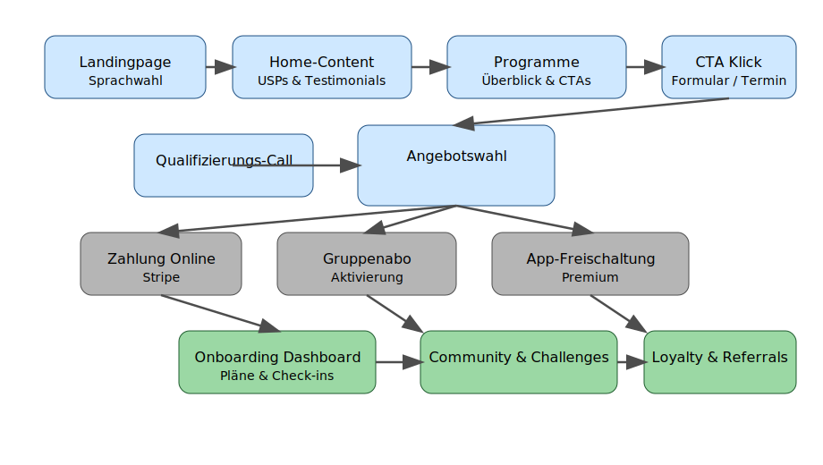

# Business Plan TTOGFIT.COM

**Datum:** 7. Juni 2024  \\
**Version:** v0.1  \\
**Autor:** Beautify Pro GmbH / TTOGFIT.COM Projektteam

## Executive Summary
TTOGFIT.COM positioniert sich als internationales Premium-Coaching-Angebot, das physische und digitale Leistungen zu einer skalierbaren Erlebniswelt bündelt. Der Fokus liegt auf messbaren Resultaten, persönlicher Betreuung über Video-Check-ins sowie einer mobilen App, die Training, Ernährung und Community-Elemente vereint.

## Positionierung
- Premium-Personal-Training mit Schweizer Qualitätsversprechen und internationaler Verfügbarkeit.
- Hybridmodell aus 1:1-Betreuung, Gruppenmotivation und App-gestützter Selbstführung.
- Klarer USP: datenbasierte Fortschrittsmessung, multilinguale Betreuung und konsequente Datenschutzkonformität.

## Zielgruppenanalyse
| Segment | Bedürfnisse | Value Proposition |
| --- | --- | --- |
| Vielbeschäftigte Executives (30-55) | Effiziente Sessions, flexible Terminplanung, diskrete Betreuung | Zeitoptimierte High-Performance-Pläne, Concierge-Service |
| Expat-Familien in Metropolen | Mehrsprachige Betreuung, Familienintegration, Remote-Zugriff | Internationale Coaches, Hybrid-Coaching vor Ort und online |
| Digitale Nomaden | Ortsunabhängige Workouts, App-Support, Tracking | Globales Netzwerk an Studios + App für Selbstcoaching |
| Gesundheitsbewusste Millennials | Community, Gamification, transparente Preise | Gruppenchallenges, App-Badges, Abo-Modelle |

## Produktlinien
### 1:1 Coaching
- Personalisierte Trainings- und Ernährungspläne.
- Video-Check-ins im Wochenrhythmus.
- Zugang zu Premium-App-Funktionen (z. B. Apple Health / Garmin Sync).

### Gruppenprogramm
- Live-Coachings in Kleingruppen (virtuell & lokal).
- Community-Forum mit Challenges und Leaderboards.
- Quartalsweise Themen-Workshops (Ernährung, Mindset, Mobility).

### App-Coaching
- Individualisierte Onboarding-Strecke mit Zieldefinition.
- Automatisierte Erinnerungen, Progress Tracking und Content Drops.
- Upsell-Mechanismen für 1:1 Sessions oder Retreats.

## Umsatzmodell & Preisspannen
| Produkt | Preismodell | Range (CHF) |
| --- | --- | --- |
| 1:1 Coaching | Monatsabo (3-, 6-, 12-Monate) | 450 – 1'100 pro Monat |
| Gruppenprogramm | Quartalsabo / Rolling Subscription | 220 – 450 pro Quartal |
| App-Coaching | Freemium + Premium Upgrade | 19 – 59 pro Monat |
| Retreats & Events | Einmalzahlung | 1'200 – 2'500 pro Event |
| Corporate Pakete | Rahmenverträge | ab 12'000 pro Jahr |

## Marketingstrategie
### Owned Media
- Blog / Knowledge Hub mit SEO-Fokus (Training, Ernährung, Motivation, International).
- Newsletter mit segmentierten Automationen (Willkommensserie, Event-Reminder, Upsells).

### Paid & Earned Media
- Performance Ads auf Meta, LinkedIn und YouTube; zielgruppenbasierte Creatives.
- Kooperationen mit Premium-Hotels und medizinischen Zentren.
- Affiliate-Programm für Influencer und Corporate-Wellbeing-Partner.

### Community & Retention
- Gamifizierte Challenges innerhalb der App.
- Ambassador-Programm mit Vorher-Nachher-Stories.
- Referral-Boni (z. B. Gratis-Monat für Werber:in und Geworbene:n).

## Kennzahlen-Ziele (Jahr 1)
- Lead-to-Call Conversion: ≥ 18 %.
- Call-to-Client Conversion: ≥ 35 %.
- Customer Lifetime Value: ≥ CHF 2'400.
- Churn Rate App Premium: ≤ 4 % pro Monat.
- NPS: ≥ 60.

## Risiken & Gegenmassnahmen
- **Skalierbarkeit der Coaches:** Aufbau eines zertifizierten Partnernetzwerks mit Onboarding-Standards.
- **Abhängigkeit von Drittplattformen:** Mehrgleisige Integrationen (Trainerize, My PT Hub, eigenes API-Layer).
- **Datenschutzverletzungen:** Privacy-by-Design, jährliche Audits, verschlüsselter Datenzugriff.
- **Marktschwankungen:** Variable Preisgestaltung, Corporate-Verträge als Stabilitätsanker.

## Investitionsbedarf (erste 12 Monate)
- Produktentwicklung (App + Dashboard): CHF 180'000.
- Marketing & Launch (Paid Media, Content): CHF 120'000.
- Operations (Team, Infrastruktur, Recht): CHF 90'000.
- Reserve für Internationalisierung / Lokalisierung: CHF 60'000.

## Marketing Funnel
Das folgende Diagramm illustriert den End-to-End-Funnel von der ersten Kontaktaufnahme bis zur langfristigen Bindung.

## Nächste Schritte
- Verprobung des Preis- und Angebotsportfolios in Fokusgruppen.
- Aufbau von Tracking-Infrastruktur (Plausible, HubSpot, Stripe Analytics).
- Vorbereitung der technischen Architektur- und Sicherheitsdokumente für Phase 2.
