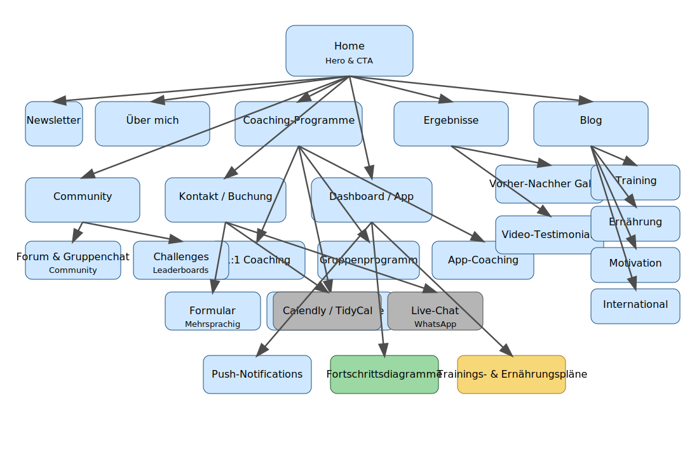

# Informationsarchitektur TTOGFIT.COM

**Datum:** 7. Juni 2024  \\
**Version:** v0.1  \\
**Autor:** Beautify Pro GmbH / TTOGFIT.COM Projektteam

## Überblick
Die Informationsarchitektur gewährleistet, dass Nutzer:innen ihre Ziele innert drei Klicks erreichen. Sie kombiniert eine klare Sitemap mit priorisierten Content-Modulen und konsistenter Navigation über Web, App und Community.

## Sitemap
- **Home**
  - Hero mit Video-Background, Claim, Primär-CTA
  - USPs (Effizienz, Resultate, Datenschutz)
  - Testimonials-Karussell (international)
  - Angebots-Teaser (1:1, Gruppe, App)
  - Newsletter-Opt-in
  - Footer mit Social Links, Kontakt, Impressum, Datenschutz, AGB
- **Über mich**
  - Portrait-Video, Qualifikationen, Vision
  - CTA „Kostenloses Erstgespräch“
  - Medienfeatures / Awards
- **Coaching-Programme**
  - Registerkarte 1:1 Coaching (Highlights, CTA „Jetzt buchen“)
  - Registerkarte Gruppenprogramm (Community, CTA „Gruppe beitreten“)
  - Registerkarte App-Coaching (Integrationen, CTA „Start Today“)
  - Vergleichstabelle & Add-ons (Retreats, Corporate)
- **Ergebnisse**
  - Vorher-Nachher-Galerie mit Filter (Land, Sprache)
  - Video-Testimonials
  - CTA „Transformation starten“
- **Blog / Knowledge Hub**
  - Kategorien: Training, Ernährung, Motivation, International
  - Suche, Filter, Empfohlene Artikel
  - CTA Newsletter / Free Tips
- **Kontakt / Buchung**
  - Formular (Name, E-Mail, Land, Sprache, Ziel)
  - Calendly / TidyCal Widget mit Zeitzonenlogik
  - Live-Chat / WhatsApp CTA
- **Newsletter / Freebie**
  - Pop-up oder Inline-Form „7-Tage-Fitnessplan“
  - Automatisierte E-Mail-Sequenz
- **Community / Gamification (Premium)**
  - Forum / Gruppenchat
  - Badges, Leaderboards, Challenges
  - Fortschritts-Sharing
- **Dashboard / Mobile App**
  - Trainings- & Ernährungspläne
  - Fortschrittsdiagramme
  - Push-Notifications
  - Mobile optimiert

## Content-Module & Prioritäten
| Seite | Above the Fold | Mid Page | Footerbereich |
| --- | --- | --- | --- |
| Home | Hero, Primär-CTA, Sprachumschaltung | USPs, Testimonials, Angebots-Teaser | Newsletter, Trust-Symbole, Footer-Links |
| Über mich | Video-Intro, CTA Erstgespräch | Laufbahn & Zertifikate, Kundenstimmen | Medienlogos, Kontakt |
| Programme | Angebots-Navigation, CTA | Feature-Details, Vergleichstabelle | FAQ, Kontakt zu Sales |
| Ergebnisse | Highlight-Galerie, CTA Transformation | Kundenfilter, Stories | Referral-CTA, Newsletter |
| Blog | Suche, Kategorien | Artikel-Stream, Lead-Magnet | Top-Artikel, Social Links |
| Kontakt | Mehrsprachige Terminwahl | Formular, Support-Optionen | Datenschutz-Hinweise, Impressum |

## Navigation & Crosslinks
- Primäre Navigation: Home, Über mich, Programme, Ergebnisse, Blog, Kontakt.
- Sekundäre Navigation (Header Utility): Sprache, Login Dashboard/App, Newsletter.
- Footer Navigation: Rechtliches, AGB, Datenschutz, Impressum, Partner.
- Crosslinks:
  - Testimonials verlinken zu Programme + Kontakt.
  - Blogartikel verweisen auf relevante Programme.
  - Dashboard kündigt neue Challenges und verweist auf Community.

## CTA-Platzierungen
- Home: Primär-CTA „Jetzt Coaching starten“ (Hero), Sekundär-CTA „Programm vergleichen“.
- Über mich: CTA „Kostenloses Erstgespräch“ (Above the Fold und Mid Page).
- Programme: CTA pro Produktkarte, Sticky CTA „Kostenloses Beratungsgespräch“.
- Ergebnisse: CTA „Transformation starten“ über Testimonials.
- Blog: CTA „Newsletter abonnieren“ nach jedem dritten Beitrag.
- Kontakt: CTA „Termin sichern“ neben Formular und im Sticky Footer.

## Informationsarchitektur-Diagramm
Die Struktur wird im folgenden Diagramm visualisiert.

## Governance
- Pflegeverantwortung Content: Marketingteam.
- Übersetzungen: Lokale Partner:innen pro Sprachraum.
- Aktualisierungszyklen: Sitemap-Review quartalsweise, Module halbjährlich.
