---
**Dokument:** TTOGFIT.COM – Website Funktionsweise
**Version:** 1.0.0
**Datum:** 2025-11-07
**Autor:** Beautify Pro GmbH / TTOGFIT.COM Projektteam
**Status:** Aktiv
**Kategorie:** Technische Dokumentation
---

# 🎯 TTOGFIT.COM – Wie die Website funktioniert

> **Eine moderne Personal Training Plattform für Premium Online-Coaching**

---

## 📋 Inhaltsverzeichnis

1. [Überblick](#überblick)
2. [System-Architektur](#system-architektur)
3. [Benutzer-Journey](#benutzer-journey)
4. [Hauptfunktionen](#hauptfunktionen)
5. [Technologie-Stack](#technologie-stack)
6. [Datenfluss](#datenfluss)
7. [Integration & APIs](#integration--apis)

---

## 🌟 Überblick

TTOGFIT.COM ist eine Premium-Personal-Training-Plattform, die traditionelles Coaching mit modernster digitaler Technologie verbindet.

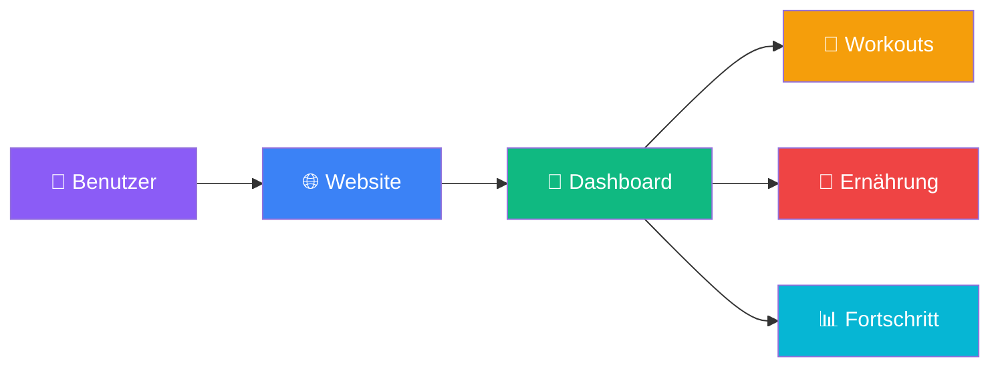

### 🎯 Hauptziele

- **Personalisiertes Coaching** – Individuelle Trainings- und Ernährungspläne
- **24/7 Zugang** – Jederzeit und überall verfügbar
- **Messbare Resultate** – Detailliertes Progress-Tracking
- **Premium Erfahrung** – Erstklassige Benutzeroberfläche

---

## 🏗️ System-Architektur

### High-Level Architektur

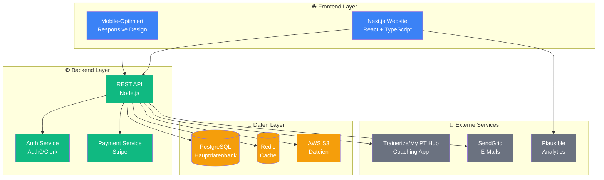

### 📦 Komponenten-Übersicht

| Komponente | Technologie | Zweck |
|------------|-------------|-------|
| **Frontend** | Next.js 14+ | Server-Side Rendering, SEO |
| **Backend** | Node.js + Express | REST API, Business Logic |
| **Datenbank** | PostgreSQL | Benutzerdaten, Workouts |
| **Cache** | Redis | Session Management, Performance |
| **Storage** | AWS S3 | Bilder, Videos, Dokumente |
| **Auth** | Auth0/Clerk | Sichere Authentifizierung |
| **Payment** | Stripe | Zahlungsabwicklung |

---

## 👥 Benutzer-Journey

### 1️⃣ Entdeckung & Anmeldung

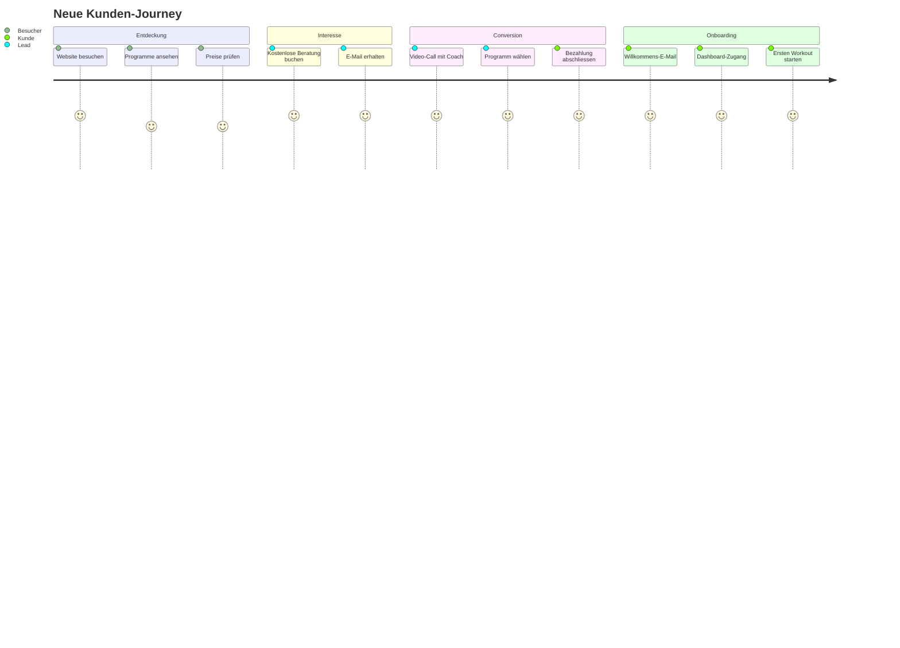

### 2️⃣ Haupt-Nutzerfluss

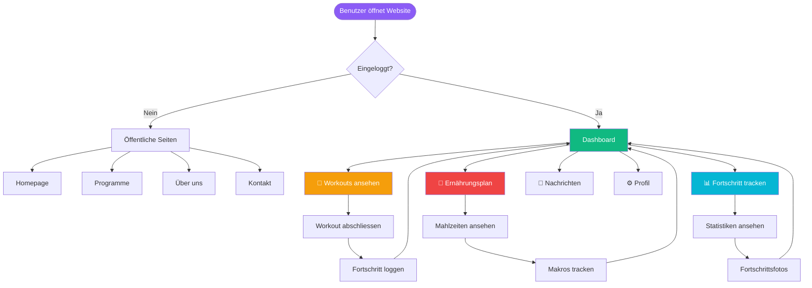

---

## ⚡ Hauptfunktionen

### 🏠 Homepage

**Zweck:** Erste Anlaufstelle für neue Besucher

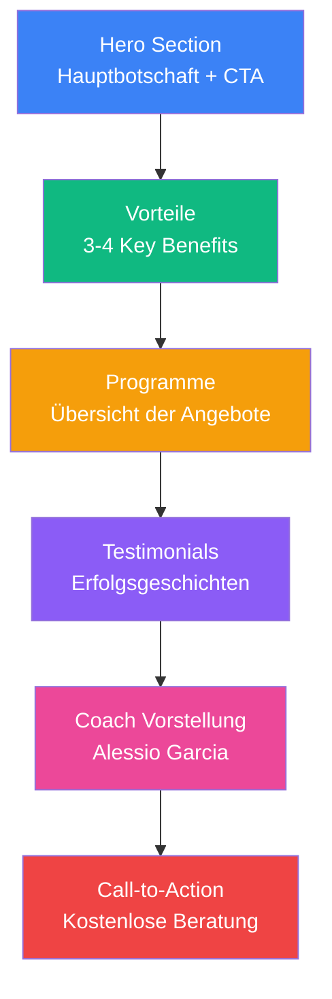

**Hauptelemente:**
- ✨ Hero-Bereich mit starker Botschaft
- 🎯 Klare Value Proposition
- 📸 Professionelle Bilder & Videos
- 💬 Social Proof (Testimonials)
- 📞 Einfacher Buchungsprozess

---

### 📱 Dashboard (Kundenbereich)

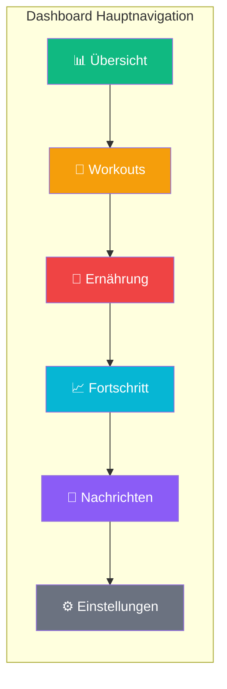

#### 💪 Workout-Modul

**Features:**
- Wöchentlicher Trainingsplan
- Video-Anleitungen für jede Übung
- Progress-Tracking (Gewicht, Wiederholungen)
- Timer & Rest-Perioden
- Notizen & Feedback

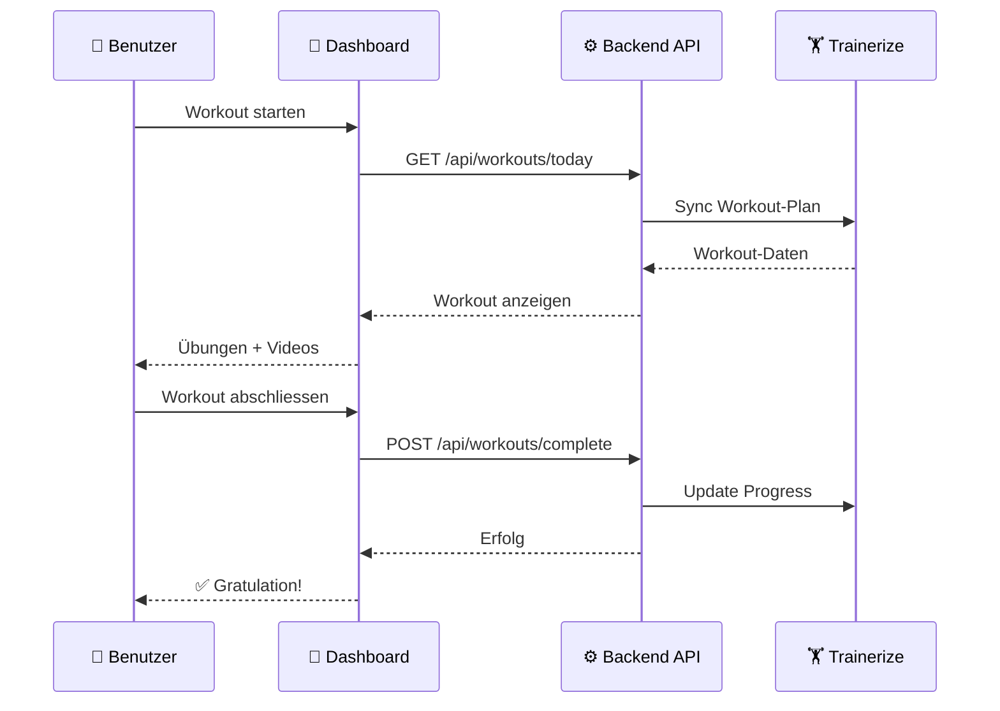

#### 🥗 Ernährungs-Modul

**Features:**
- Personalisierter Essensplan
- Makro-Tracking (Protein, Kohlenhydrate, Fette)
- Rezept-Datenbank
- Einkaufslisten
- Wasseraufnahme-Tracker

#### 📈 Fortschritts-Modul

**Features:**
- Gewichtsverlauf (Chart)
- Körpermaße-Tracking
- Fortschrittsfotos (Vorher/Nachher)
- Kraft-Entwicklung
- Wöchentliche Reports

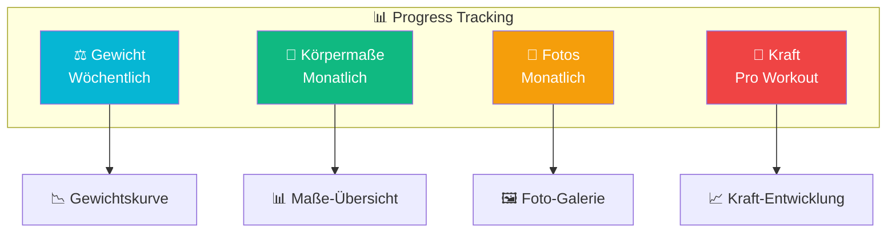

---

## 🛠️ Technologie-Stack

### Frontend

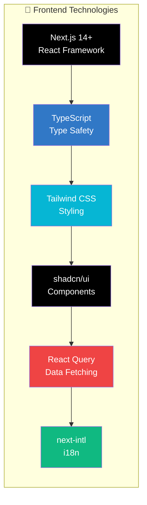

**Hauptmerkmale:**
- ⚡ **Next.js 14+** – Server-Side Rendering für SEO
- 🎯 **TypeScript** – Weniger Fehler, bessere Entwicklererfahrung
- 🎨 **Tailwind CSS** – Utility-First CSS Framework
- 🧩 **shadcn/ui** – Wiederverwendbare UI-Komponenten
- 🔄 **React Query** – Effizientes Daten-Management
- 🌍 **next-intl** – Mehrsprachigkeit (DE, EN, FR, IT)

### Backend

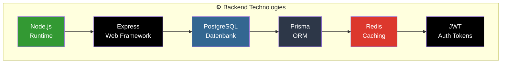

**Hauptmerkmale:**
- 🟢 **Node.js** – JavaScript Runtime
- 🚀 **Express** – Minimalistische Web-Framework
- 🐘 **PostgreSQL** – Relationale Datenbank
- 🔷 **Prisma** – Type-Safe Database Client
- ⚡ **Redis** – In-Memory Caching
- 🔐 **JWT** – Sichere Token-basierte Auth

---

## 🔄 Datenfluss

### Benutzer-Authentifizierung

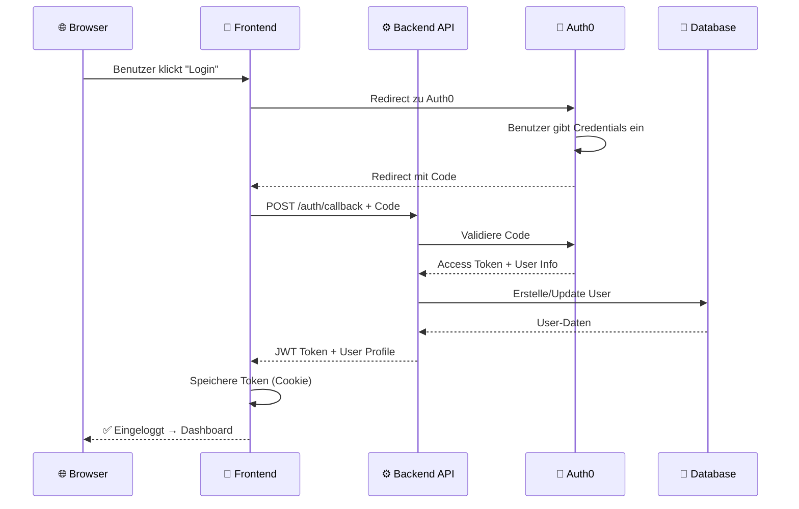

### Workout-Synchronisation

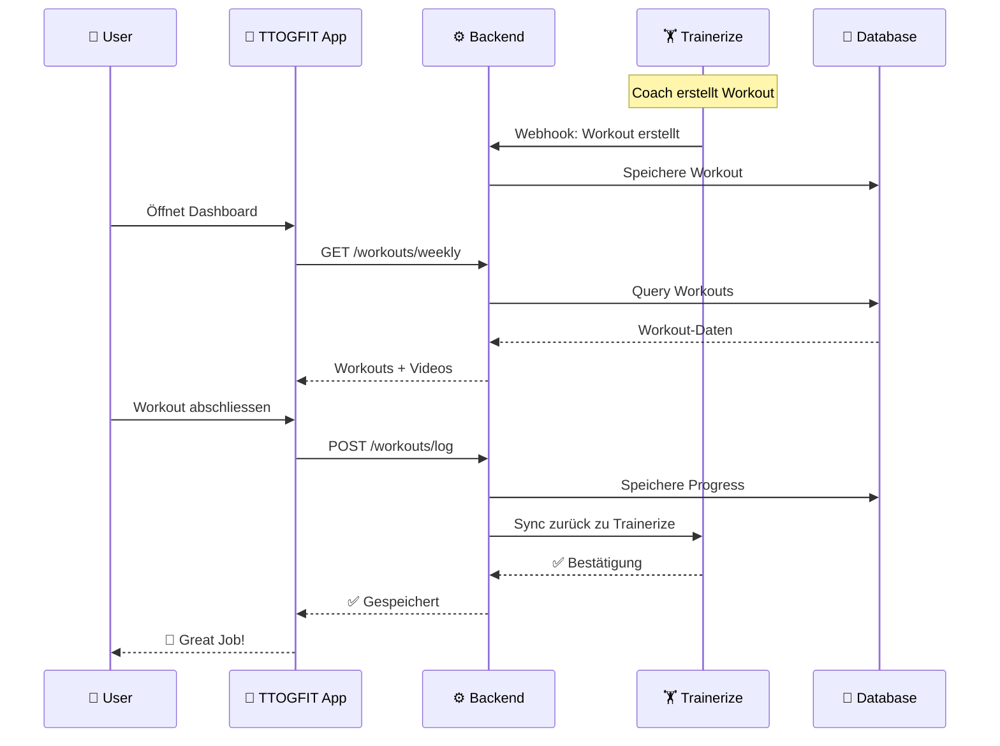

### Payment-Flow

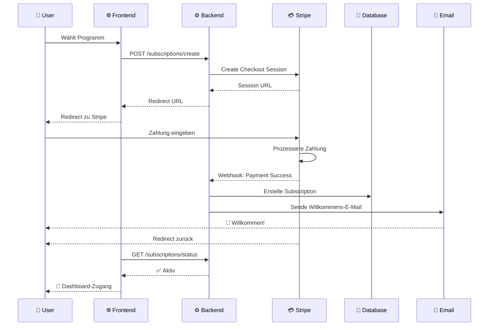

---

## 🔌 Integration & APIs

### Integrierte Services

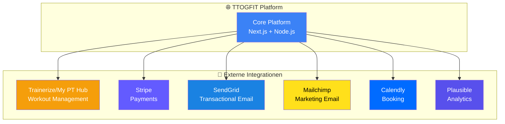

### API-Endpunkte (Beispiele)

#### 🔐 Authentifizierung

```
POST   /api/auth/login          - Benutzer-Login
POST   /api/auth/register       - Neuer Benutzer
POST   /api/auth/logout         - Ausloggen
GET    /api/auth/me             - Aktueller Benutzer
```

#### 👤 Benutzer

```
GET    /api/users/:id           - Benutzer-Profil
PATCH  /api/users/:id           - Profil aktualisieren
GET    /api/users/:id/stats     - Benutzer-Statistiken
```

#### 💪 Workouts

```
GET    /api/workouts/weekly     - Wöchentlicher Plan
GET    /api/workouts/:id        - Einzelnes Workout
POST   /api/workouts/:id/log    - Workout loggen
GET    /api/exercises           - Übungs-Bibliothek
```

#### 🥗 Ernährung

```
GET    /api/nutrition/plan      - Aktueller Essensplan
GET    /api/nutrition/recipes   - Rezept-Datenbank
POST   /api/nutrition/log       - Mahlzeit loggen
GET    /api/nutrition/macros    - Makro-Übersicht
```

#### 💳 Subscriptions

```
POST   /api/subscriptions/create    - Neue Subscription
GET    /api/subscriptions/:id       - Subscription-Details
POST   /api/subscriptions/:id/cancel - Kündigen
GET    /api/subscriptions/invoices  - Rechnungen
```

---

## 📊 Performance & Monitoring

### Core Web Vitals Ziele

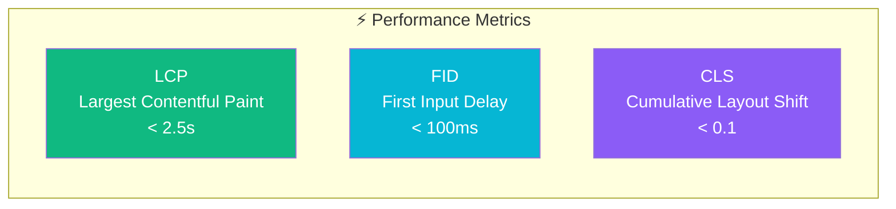

### Monitoring Tools

| Tool | Zweck | Metriken |
|------|-------|----------|
| **Vercel Analytics** | Performance Tracking | Core Web Vitals, Load Time |
| **Sentry** | Error Tracking | Fehler, Crashes, Performance |
| **Plausible** | Web Analytics | Traffic, Conversions, Privacy-First |
| **LogRocket** | Session Replay | User Behavior, Bugs |
| **UptimeRobot** | Uptime Monitoring | Verfügbarkeit 99.9%+ |

---

## 🔒 Sicherheit

### Sicherheits-Ebenen

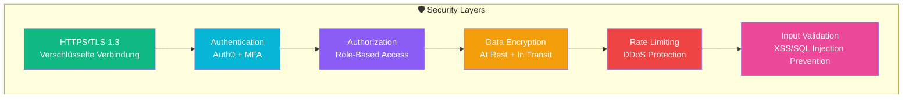

**Hauptmerkmale:**
- ✅ HTTPS überall (TLS 1.3)
- ✅ Multi-Factor Authentication (MFA)
- ✅ DSGVO/DSG-konform
- ✅ Regular Security Audits
- ✅ Encrypted Data Storage
- ✅ DDoS Protection (Cloudflare)

---

## 🌍 Internationalisierung

Die Website unterstützt mehrere Sprachen:

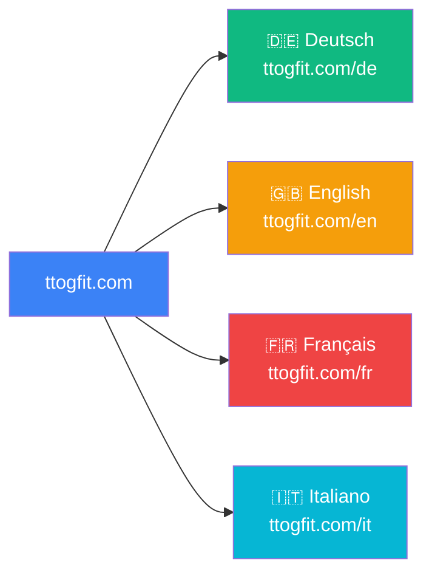

**Features:**
- Automatische Spracherkennung (Browser-Sprache)
- URL-basiertes Routing (`/de`, `/en`, `/fr`, `/it`)
- Lokalisierte Inhalte (Texte, Bilder, Videos)
- Währungsumrechnung (CHF, EUR, GBP, USD)
- Zeitzone-Anpassung für Buchungen

---

## 📱 Responsive Design

Die Website funktioniert perfekt auf allen Geräten:

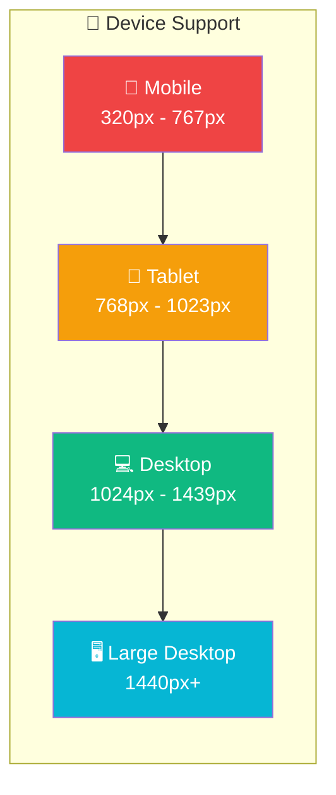

**Mobile-First Approach:**
- ✅ Touch-optimierte Buttons
- ✅ Swipe-Navigation
- ✅ Optimierte Bildgrößen
- ✅ Progressive Web App (PWA)
- ✅ Offline-Funktionalität (teilweise)

---

## 🚀 Deployment & Hosting

### Deployment-Pipeline

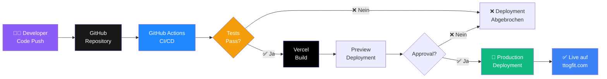

**Hosting-Infrastruktur:**
- **Frontend:** Vercel (Global CDN)
- **Backend:** Railway / AWS ECS
- **Datenbank:** AWS RDS (PostgreSQL)
- **Cache:** Redis Cloud
- **Storage:** AWS S3 / Cloudflare R2
- **CDN:** Cloudflare

---

## 📈 Analytics & Tracking

### Tracking-Events

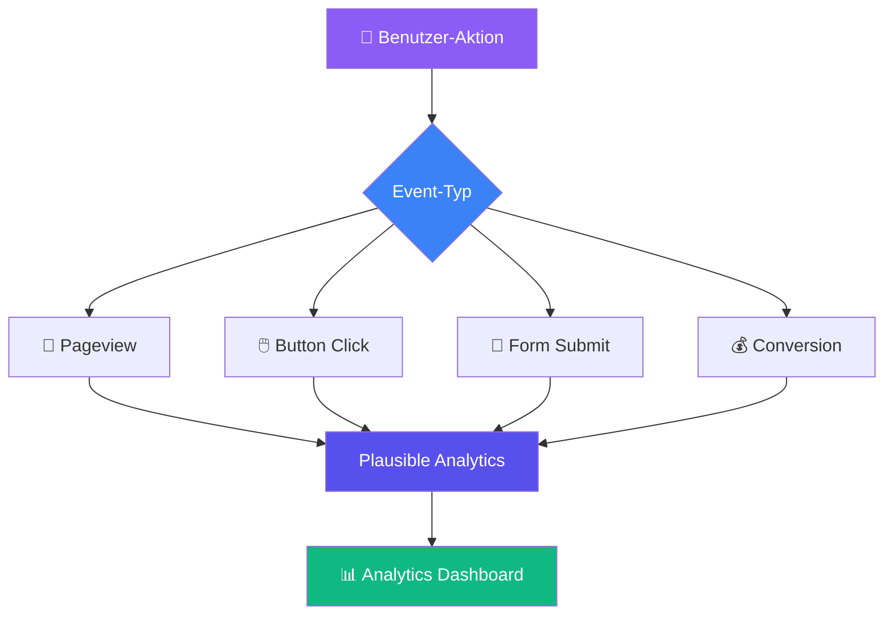

**Getrackte Metriken:**
- 📄 Seitenaufrufe
- 👥 Unique Visitors
- ⏱️ Session-Dauer
- 📊 Conversion-Rate
- 🚀 Bounce-Rate
- 🎯 Goal-Completions

**Privacy-First:**
- ✅ Kein Google Analytics
- ✅ Keine invasiven Cookies
- ✅ DSGVO-konform
- ✅ Anonymisierte Daten

---

## 🎨 Design-System

### Farbpalette

```mermaid
graph LR
    subgraph "🎨 Brand Colors"
        PRIMARY[Primary<br/>#3B82F6<br/>Blau]
        SECONDARY[Secondary<br/>#10B981<br/>Grün]
        ACCENT[Accent<br/>#F59E0B<br/>Orange]
        ERROR[Error<br/>#EF4444<br/>Rot]
        SUCCESS[Success<br/>#10B981<br/>Grün]
    end
    
    style PRIMARY fill:#3B82F6,color:#fff
    style SECONDARY fill:#10B981,color:#fff
    style ACCENT fill:#F59E0B,color:#fff
    style ERROR fill:#EF4444,color:#fff
    style SUCCESS fill:#10B981,color:#fff
```

### Typografie

- **Headings:** Inter (Bold, 700)
- **Body:** Inter (Regular, 400)
- **Code:** Fira Code (Mono)

### Komponenten-Bibliothek

Basierend auf **shadcn/ui**:
- Buttons
- Forms (Input, Select, Checkbox)
- Cards
- Modal Dialogs
- Tables
- Charts
- Navigation
- Alerts & Notifications

---

## ✅ Qualitätsstandards

### Testing

```mermaid
graph TB
    subgraph "🧪 Testing Pyramid"
        A[Unit Tests<br/>Jest + React Testing Library<br/>70%]
        B[Integration Tests<br/>Playwright<br/>20%]
        C[E2E Tests<br/>Playwright<br/>10%]
    end
    
    C --> B
    B --> A
    
    style A fill:#10B981,color:#fff
    style B fill:#3B82F6,color:#fff
    style C fill:#F59E0B,color:#fff
```

**Testabdeckung:**
- ✅ Unit Tests: >80%
- ✅ Integration Tests: Kritische Flows
- ✅ E2E Tests: User Journeys
- ✅ Performance Tests: Load Testing
- ✅ Security Tests: Penetration Testing

### Code Quality

- ✅ **TypeScript** – Type Safety
- ✅ **ESLint** – Code Linting
- ✅ **Prettier** – Code Formatting
- ✅ **Husky** – Git Hooks
- ✅ **Conventional Commits** – Commit Messages

---

## 🔮 Roadmap

### Phase 1: MVP (3 Monate)
- ✅ Website Launch
- ✅ 1:1 Coaching Modul
- ✅ Payment Integration
- ✅ Basic Dashboard

### Phase 2: Erweiterung (6 Monate)
- 🔄 Gruppenprogramme
- 🔄 Mobile App (React Native)
- 🔄 Community Features
- 🔄 Video-Library

### Phase 3: Skalierung (12 Monate)
- 📅 AI-basierte Empfehlungen
- 📅 Corporate Wellness Packages
- 📅 Internationale Expansion
- 📅 Partner-Programm

---

## 📞 Support & Kontakt

**Technischer Support:**
- 📧 E-Mail: support@ttogfit.com
- 💬 Live-Chat: Auf der Website
- 📚 Hilfe-Center: ttogfit.com/help

**Business Kontakt:**
- 📧 E-Mail: alessio@ttogfit.com
- 🌐 Website: ttogfit.com
- 📱 Social Media: @ttogfit

---

## 📚 Zusätzliche Ressourcen

- [📖 API-Dokumentation](docs/technical/API_SPECIFICATIONS.md)
- [🎨 Design-System](docs/ux-design/DESIGN_SYSTEM.md)
- [🔒 Sicherheits-Leitfaden](docs/compliance/SECURITY_PRIVACY_BRIEF.md)
- [📊 Analytics-Dashboard](#)

---

**Version:** 1.0.0  
**Letzte Aktualisierung:** 2025-11-07  
**Nächste Review:** 2026-02-07

---

**© 2025 TTOGFIT.COM – Premium Personal Training**